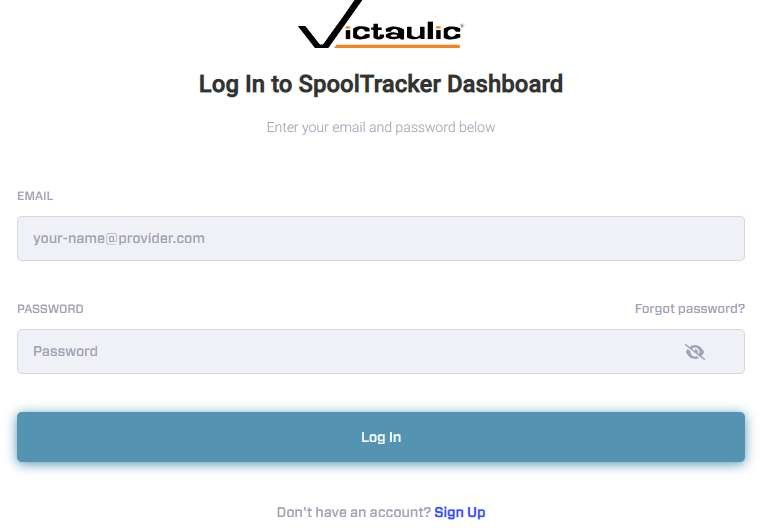
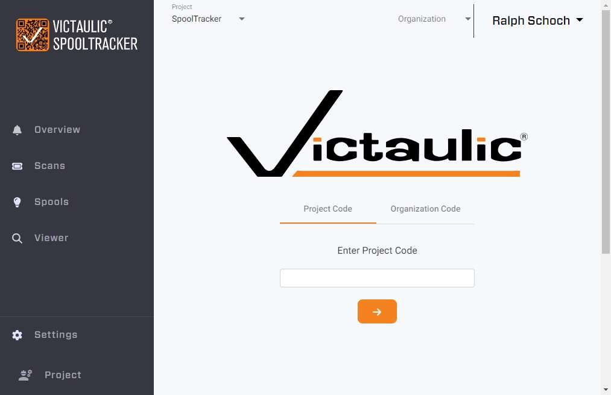

# Web Dashboard — Getting Started

## Overview

The SpoolTracker web dashboard allows you to visualize the data collected from the SpoolTracker mobile app and to administer your projects.

> **Note:** SpoolTracker projects can only be created using [Victaulic Tools for Revit](../vtfr-integration/spooltracker-setup.md). SpoolTracker only works for Revit projects — the creation of Revit assemblies is required to generate the QR codes that the mobile app reads.

**Dashboard URL:** [https://spooltracker.victaulic.com/](https://spooltracker.victaulic.com/)

## Creating an Account

You will need to create a user account via the website before logging in. Use the **Sign Up** option at the bottom of the login screen if you do not already have an account.

## First Login and Project Access

Use the **Project Code** assigned from VTFR to access your project. The first user to log in to a project is automatically elevated to **Admin** and can configure:

- **User Access** — manage who can access the project
- **Organizations** — link projects to an organization
- **Scan Types** — configure task types tracked in the mobile app (see [Project Settings](project-settings.md))

## Dashboard

After logging in with a valid Project Code, you will see the project dashboard. As an Admin, you can **add**, **edit**, and **delete** scans within the Scans tab.

