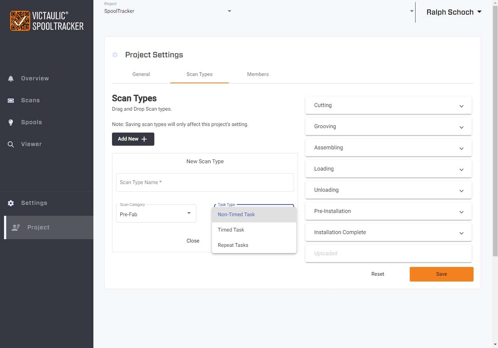

# Project Settings — Scan Types

## Overview

Project Settings allows Admins to customize the tasks tracked in the SpoolTracker mobile app. Scan types can be **deleted**, **added**, **renamed**, and **reordered** for display.

## Scan Type Configuration

There are three types of tasks available:

### Non-Timed Task

A simple status that can only be assigned **one time per spool**. Use this for milestones like "Delivered" or "Installed" where no time tracking is needed.

### Timed Task

A one-time-only task that includes a **timer** to track seconds and minutes spent on the task. The timer is displayed in the mobile app when this task type is selected. See [Timer for Timed Tasks](../mobile-app/new-scan.md#timer-for-timed-tasks) for how this appears in the mobile app.

### Repeat Task

A task that can be used **as many times as needed** per spool. This is useful for recurring activities such as QC checks or error tracking.

## Ordering and Display

Drag and drop tasks in the list to change the display order in the mobile app. The order set here determines the order shown to Installation Engineers when they select a status during scanning.

> **Important:** Don't forget to **save your changes** when done editing scan types.

## Best Practices

- **Start small** — Begin with a few essential task types and add more as needed
- **Avoid deleting used tasks** — Deleting task types that have already been used in the app is not supported
- **Scope appropriately** — Task types can be configured uniquely per **Project** or per **Organization**

