# Login & Dashboard

## Splash Screen and Opt-In

When the user opens SpoolTracker, a splash screen appears for a few seconds, then the application redirects to the **Opt-In screen**. The user must accept the terms and conditions to use the application. This is a one-time event.

  
  

  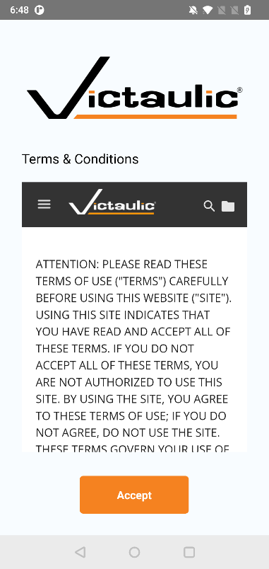
  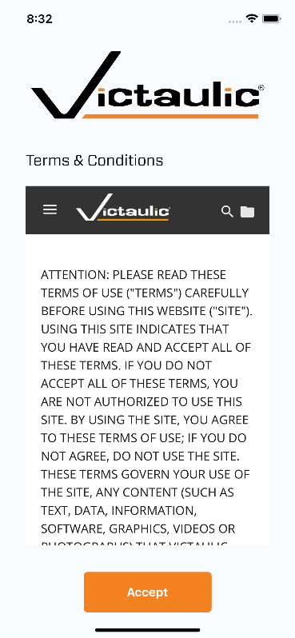

## Login

The user can log in with a valid **Project code** or **Organization code**.

  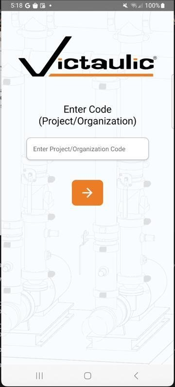
  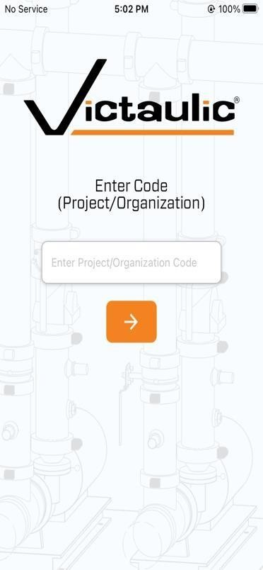

## Code Suggestions

The application provides the last successfully entered Project or Organization codes as suggestions, making it faster to log in to frequently used projects.

  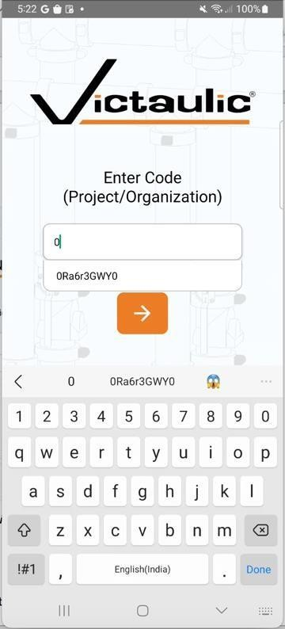
  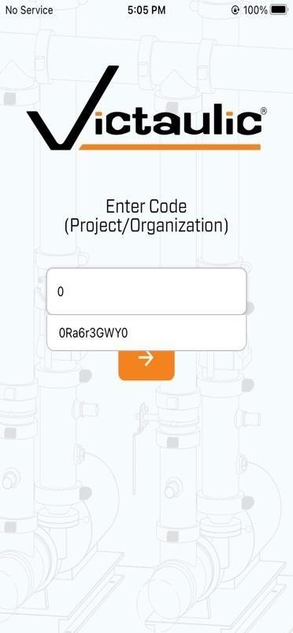

## Validation Warnings

The application displays a warning to the user if:

- The **Project code** entered is less than 8 characters
- The **Organization code** entered is less than 10 characters

  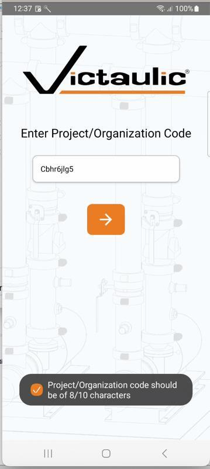
  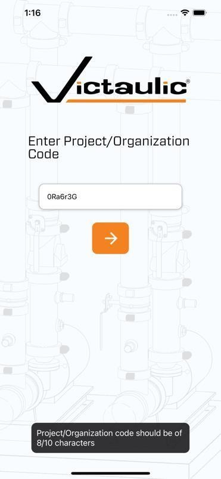

## Login Errors

The application displays an error when an incorrect Project or Organization code is entered.

  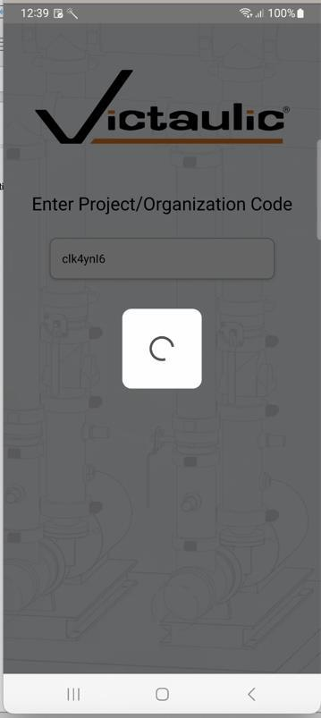
  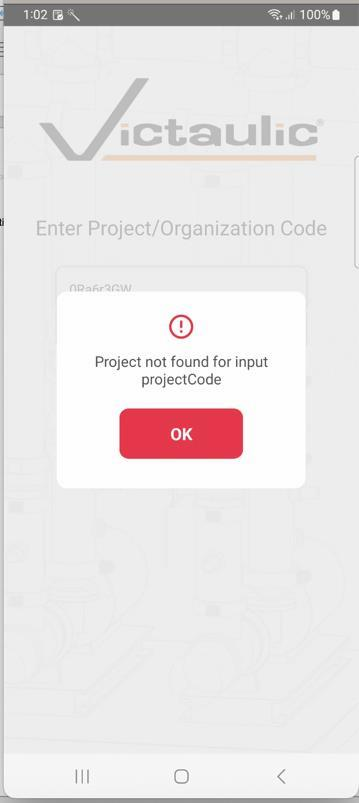
  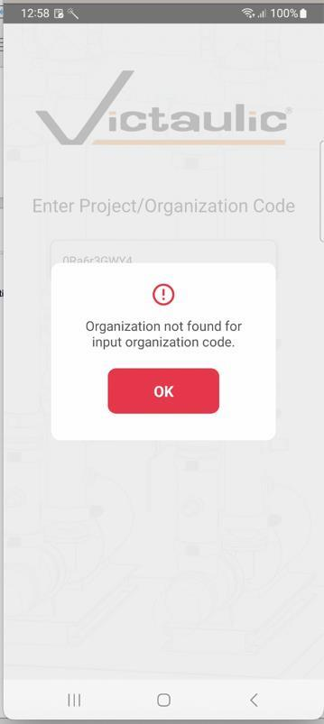

  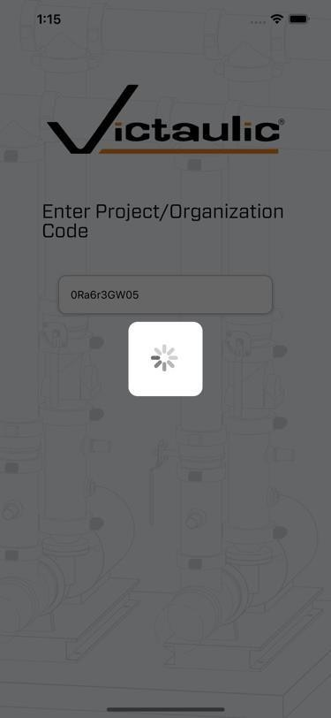
  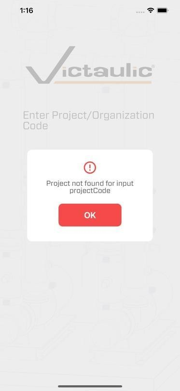
  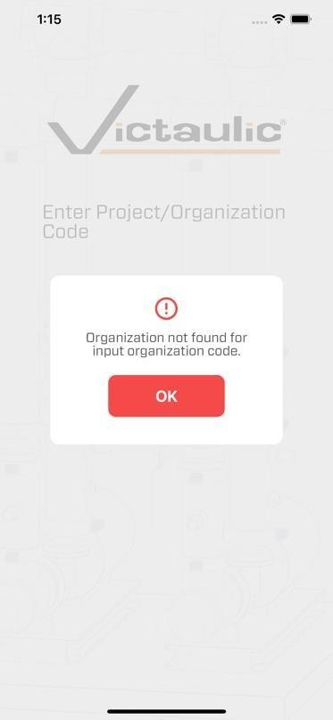

## Dashboard and Scan History

After a successful login, the application fetches the spool scan history for the entered Project or Organization code. On the home page, the user has the following options:

- **Refresh** — Pull down the history list to refresh it
- **Filter** — Filter options for scan history based on spool name and/or date range
- **Menu** — Contains two options: Settings and Logout

  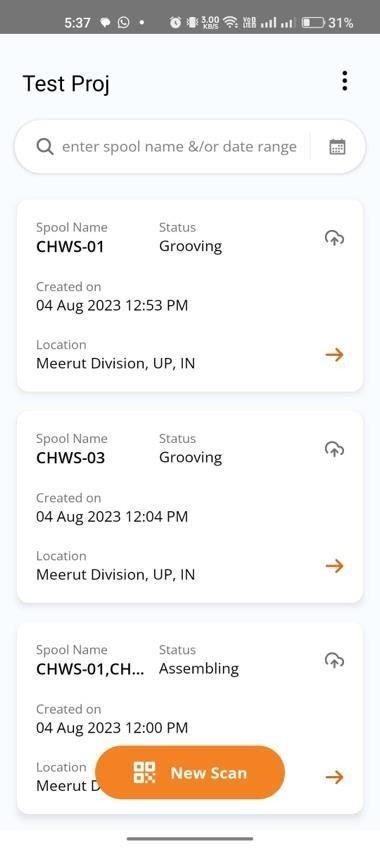
  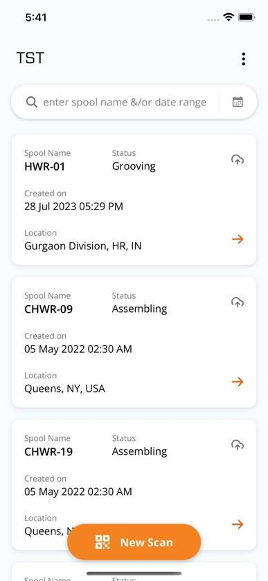

If there are no scans available in the history, the dashboard displays an empty state:

  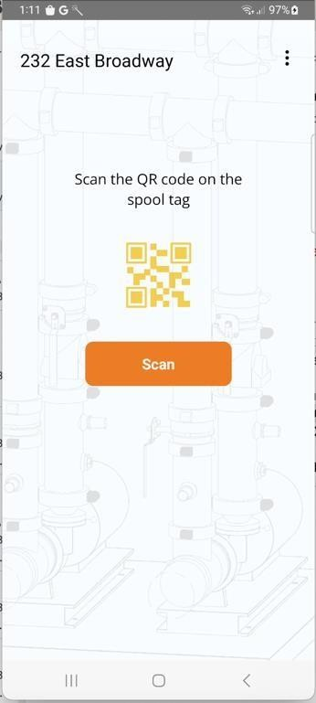
  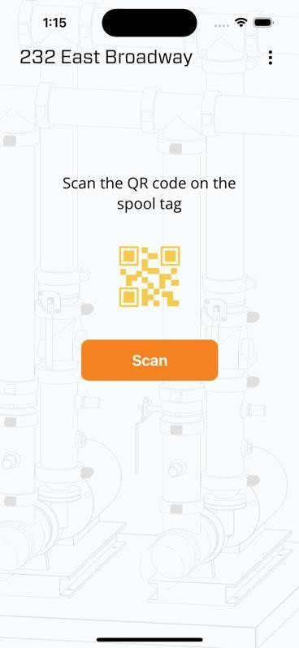

## Filtering Scan History

### Filter by Date Range

The user can filter scan history by tapping the date icon and selecting a date range.

  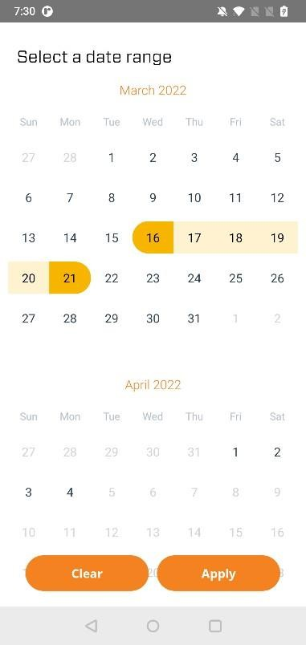
  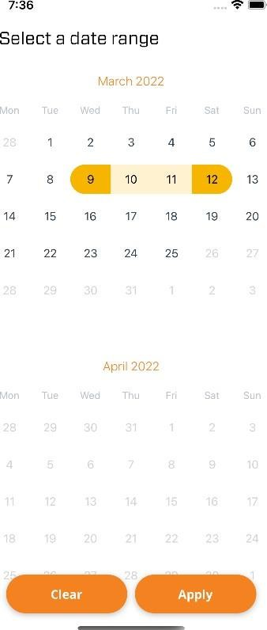

### Filter by Spool Name

The user can also filter scan history by spool name.

  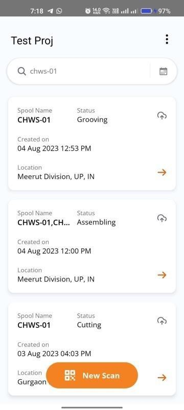
  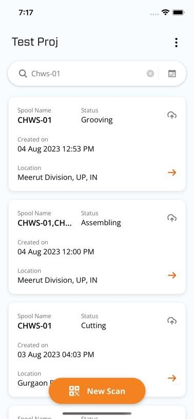

### No Results

If no data is available based on the applied filters, the application displays an empty state:

  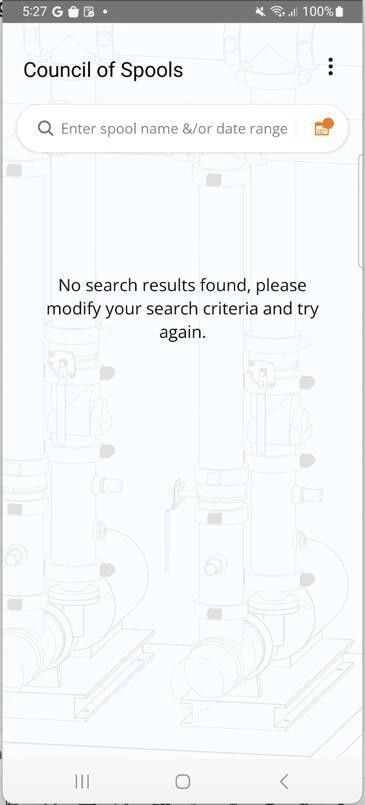
  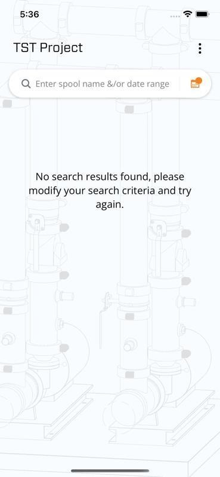

## Settings

The user can access Settings by tapping the **menu icon** (&#8942;) and selecting **Settings**. In Settings, the user can:

- Give a **name to the device** for identification
- Set a **default status** for new scans
- Change the **maximum number of QRs** allowed in a multi-scan
- Change the **location settings**

  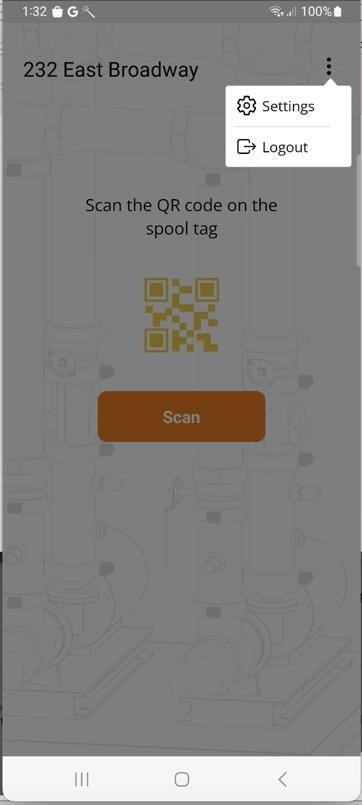
  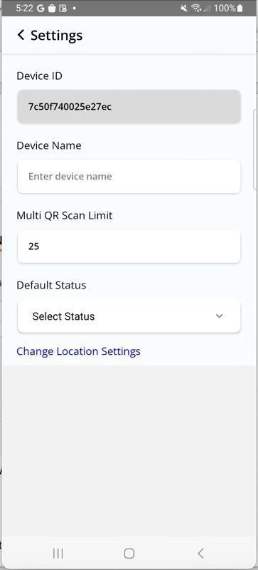

  
  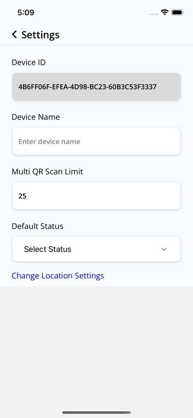

## Logout

The user can log out by tapping the **menu icon** (&#8942;) and selecting **Logout**.

> **Warning:** If there are offline records that need to be synced, the application will **not** allow the user to log out. Ensure all offline records are synced before logging out.

  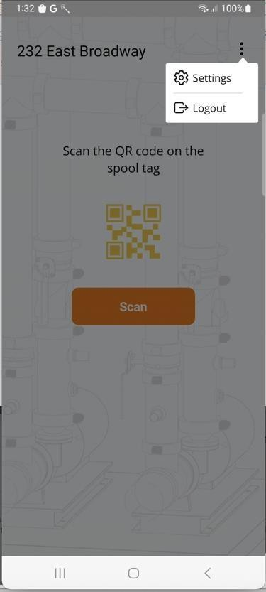
  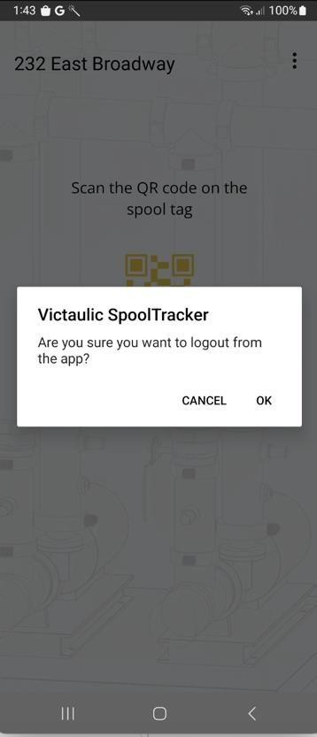
  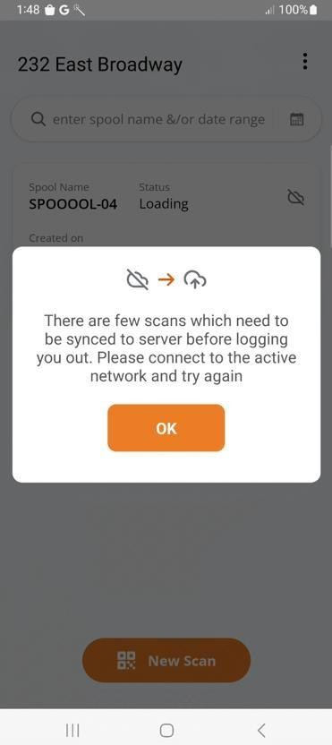

  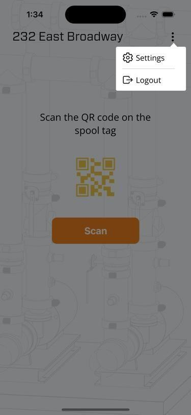
  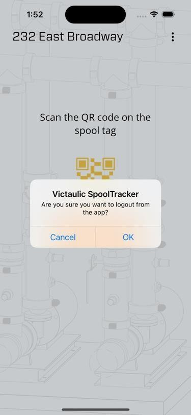
  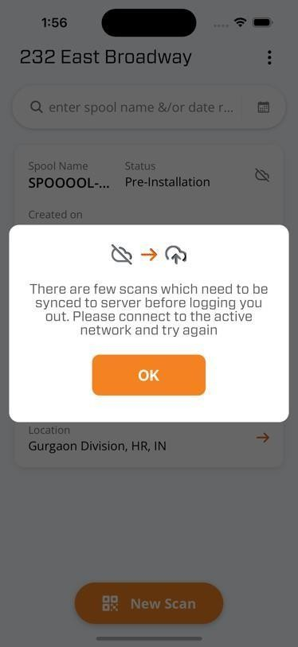

