# New Scan

## Starting a New Scan

The user can initiate a new scan by tapping the **New Scan** button on the dashboard.

## Location Permission

The application requests location permission to capture geolocation data. It is recommended to grant this permission for accurate location tracking. If the user does not wish to share their location, they can disallow the permission.

  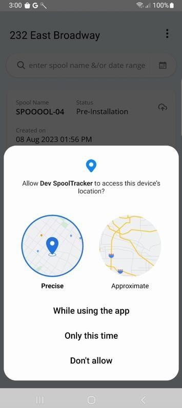
  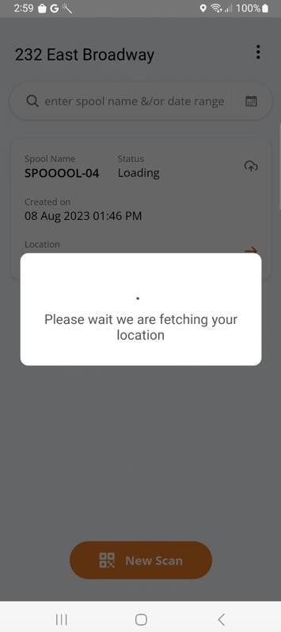

  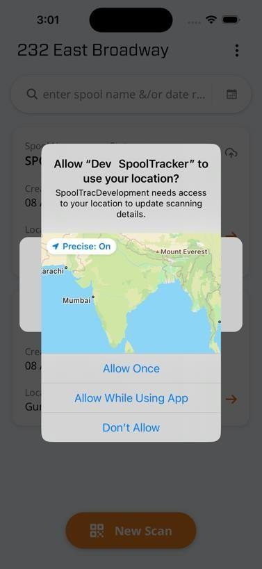
  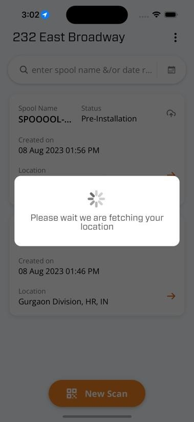

## Camera Permission

The application requests camera permission, which is **required** for scanning QR codes.

  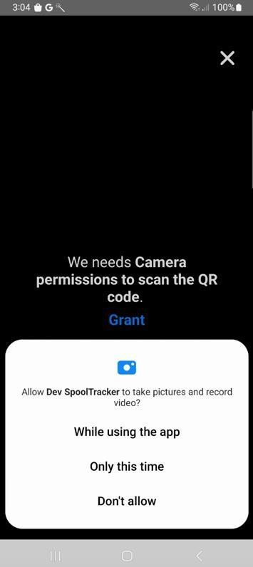
  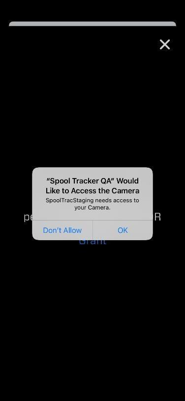

## QR Code Scanning

The user can scan single or multiple QR codes in one session.

### Single QR Scanning

Scan one QR code at a time by pointing the camera at a spool's QR label.

  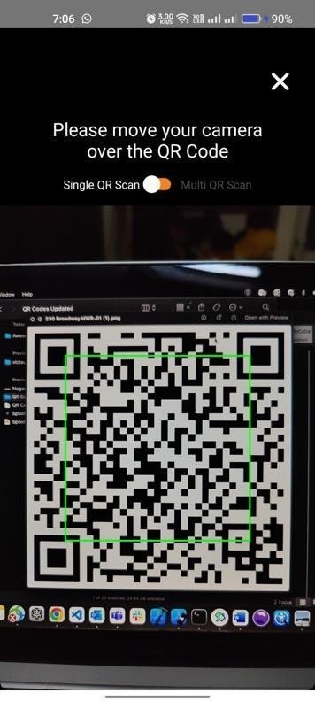
  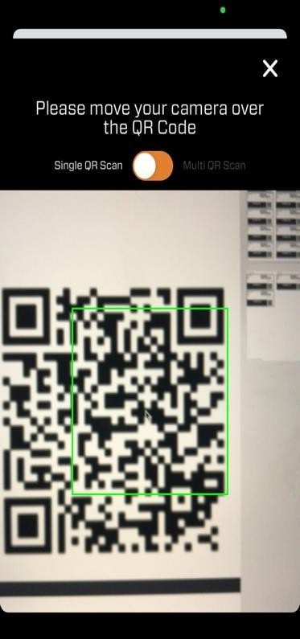

### Multiple QR Scanning

Scan multiple QR codes in sequence. The maximum number of QRs per multi-scan session can be configured in [Settings](login-and-dashboard.md#settings) (default is 25, range is 2–100).

  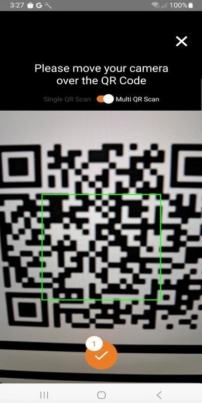
  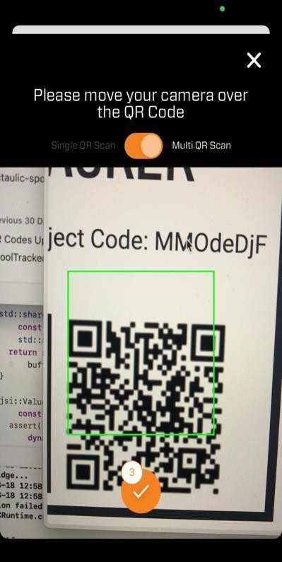

## Scan Form

If the QR code is valid, the application navigates to the **New Scan** form with the following data pre-filled:

- **Spool Name** — from the QR code
- **Location** — captured geolocation
- **Date/Time** — current timestamp

### Single QR Scan Form

  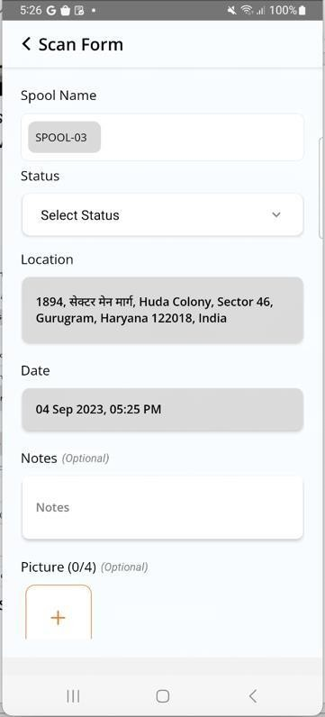
  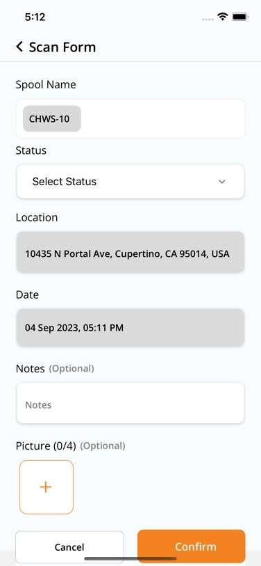

### Multiple QR Scan Form

  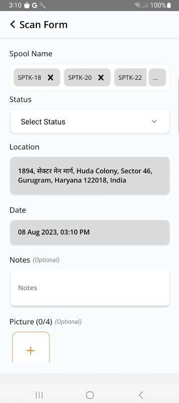
  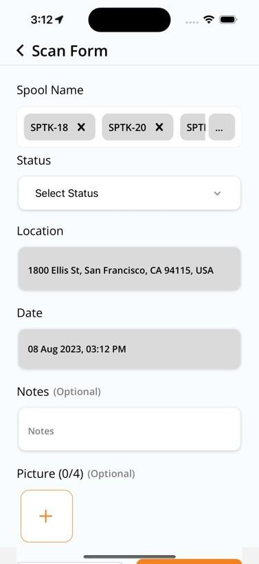

## Timer for Timed Tasks

If the selected status is a **timed task**, a timer is displayed. The user can:

- **Start** the timer to begin recording time spent on the task
- **Pause** or **Stop** the timer at any time
- Enter values in **Add Time** or **Deduct Time** fields to adjust the recorded duration

> **Tip:** Use the Add/Deduct time fields to correct for any discrepancies, such as time spent away from the task. For more on configuring timed vs. non-timed tasks, see [Project Settings](../dashboard/project-settings.md).

  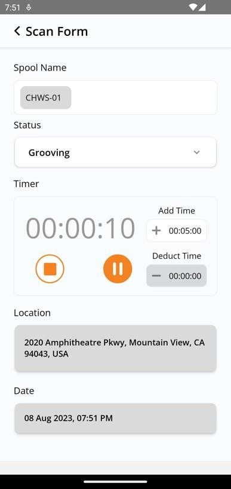
  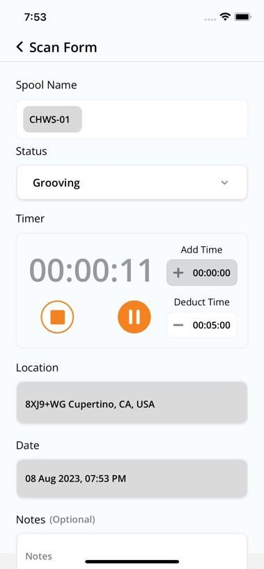

## Adding Photos

The user can add photos by tapping the **"+"** button. Up to **4 images** can be attached per scan.

  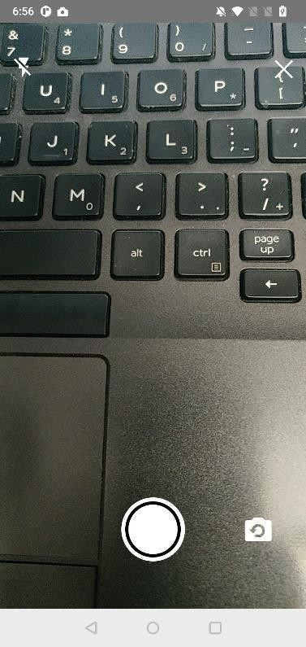
  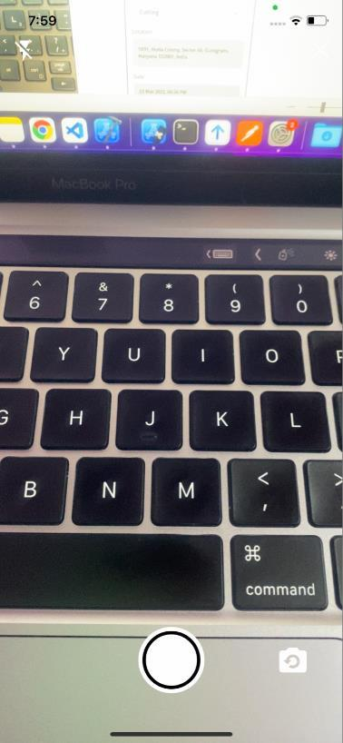

## Confirming a Scan

The user taps the **Confirm** button to save the scan. The scan is recorded and appears in the [scan history](login-and-dashboard.md#dashboard-and-scan-history).

  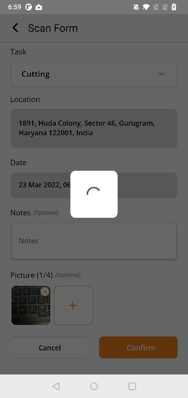
  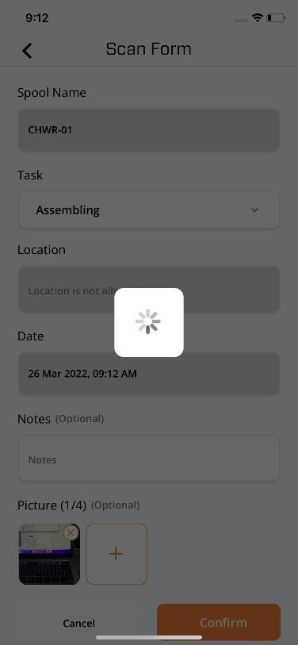

## Duplicate Scan Error

If a scan already exists with the same spool name and task, the application displays an error.

  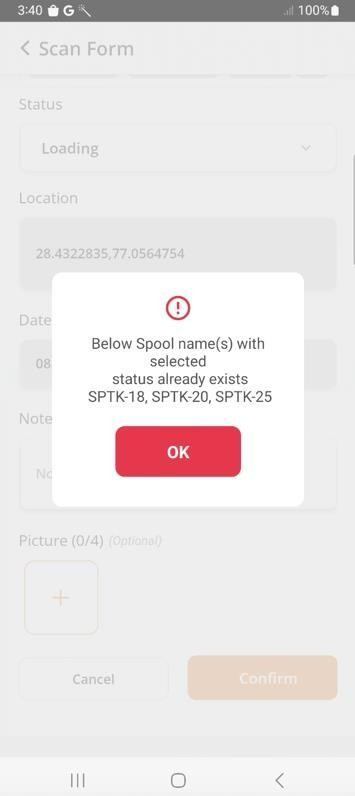
  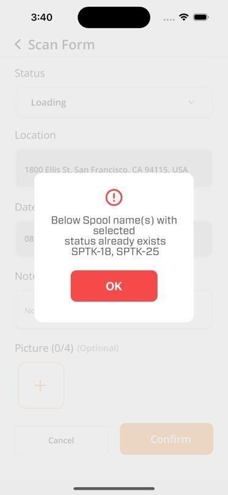

## Cancelling a Scan

The user can tap the **Cancel** button to discard the scan without saving.

  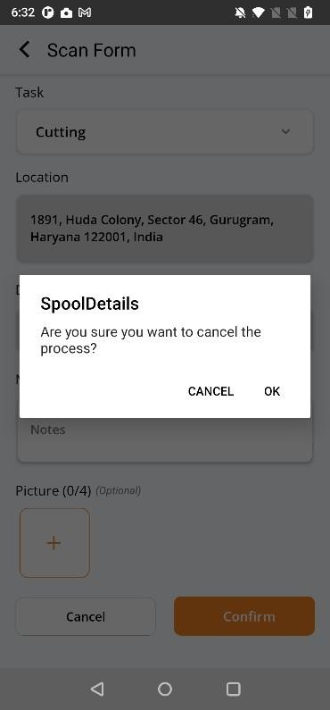
  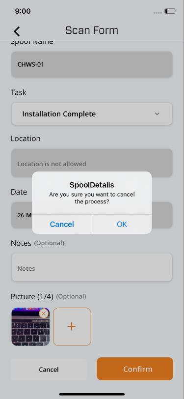

