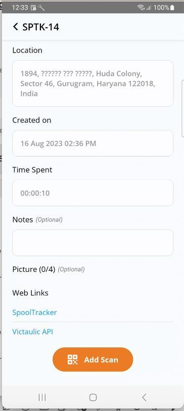
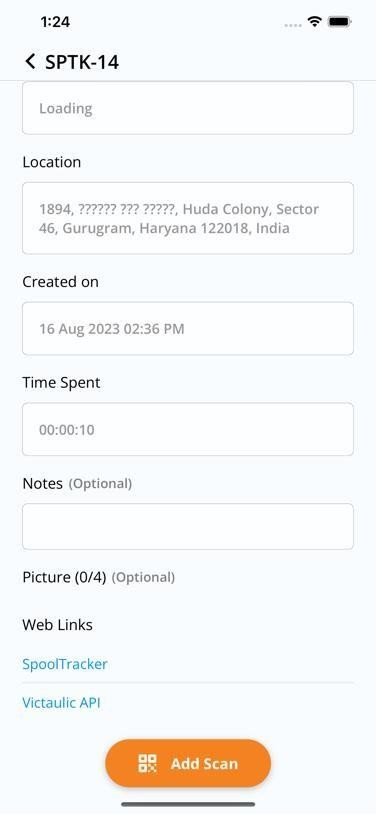
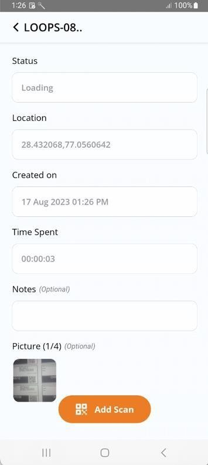
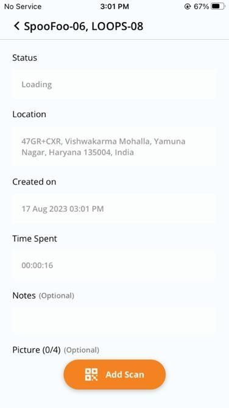
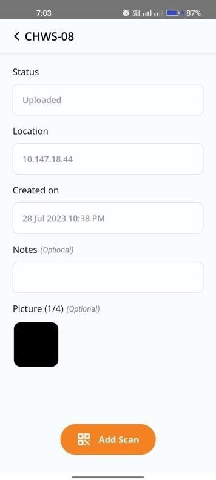
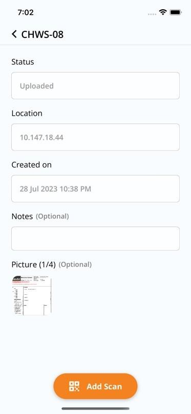

# Scan Details

## Viewing Scan Details

Installation Engineers can view previously recorded scans by tapping on a scan entry in the history list. The detail view shows all recorded information including status, notes, and images.

### Single Scan

A single scan shows the details for one individual spool.

  
  

### Multiple Scan

A multiple scan entry shows details for a batch of spools scanned together.

  
  

## Add Manual Scan

The user can add a new scan with the same spool name by pressing the **Add Scan** button on the scan details screen. This takes the user to the [New Scan](new-scan.md) form with the spool name pre-filled.

  
  

