# Installing Spooltracker on Your Device

Spooltracker is a Progressive Web App (PWA), which means you can install it directly from your browser — no app store required. Once installed, it works like a native app: launches from your home screen, works offline, and opens in its own window.

This guide walks you through the install steps for each device and browser.

---

## Jump to your device

| Device | Browser | Section |
| --- | --- | --- |
| iPhone / iPad | Safari | [iOS — Safari](#ios--safari) |
| Android | Chrome | [Android — Chrome](#android--chrome) |
| Windows / macOS | Chrome | [Desktop — Chrome](#desktop--chrome) |

---

## Icon reference

The icons below appear in your browser during installation. Knowing what they look like makes the steps easier to follow.

| Icon | Name | What it does |
| :---: | --- | --- |
| ⬆️ | **Share** | Opens the share menu (iOS Safari) |
| ⋮ | **More / Menu** (vertical dots) | Opens the browser's main menu |
| ☰ | **Menu** (hamburger) | Opens the browser's main menu (Samsung) |
| ⬇️ | **Install / Download** | Installs the app to your device |
| ➕ | **Add to Home Screen** | Adds the app to your home screen |
| ✓ | **Confirm / Add** | Confirms the install action |
| 🏠 | **Home Screen** | Where the installed app will appear |
| 📱 | **Add to phone** | Sends the app to your phone (Edge) |
| ↗️ | **Open in new window** | The app launches in its own window |

---

## iOS — Safari

> Supported on iOS 11.3+ and iPadOS. Installation must be done from **Safari** — Chrome and Firefox on iOS cannot install PWAs.

1. In Safari, navigate to https://spooltracker.victaulic.com/app
    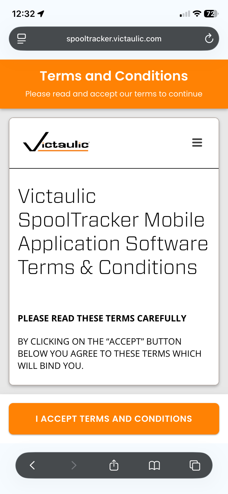

2. Tap the **Share** button ⬆️ at the bottom of the screen. Depending on your settings, it could be found at the top of your screen.

   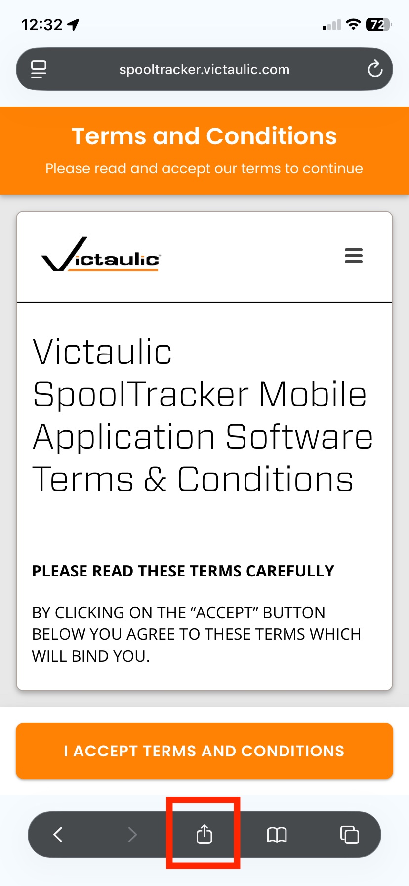

3. Scroll down in the share sheet and tap **Add to Home Screen** ➕.

   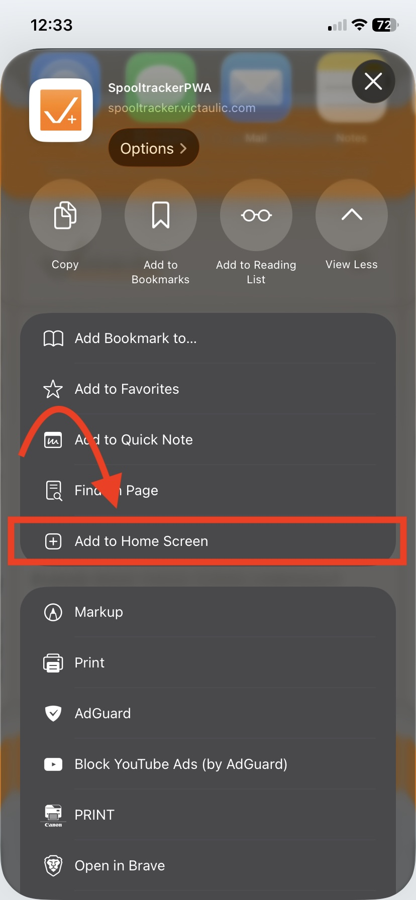

4. Tap **Add** ✓ in the top-right corner to confirm.

   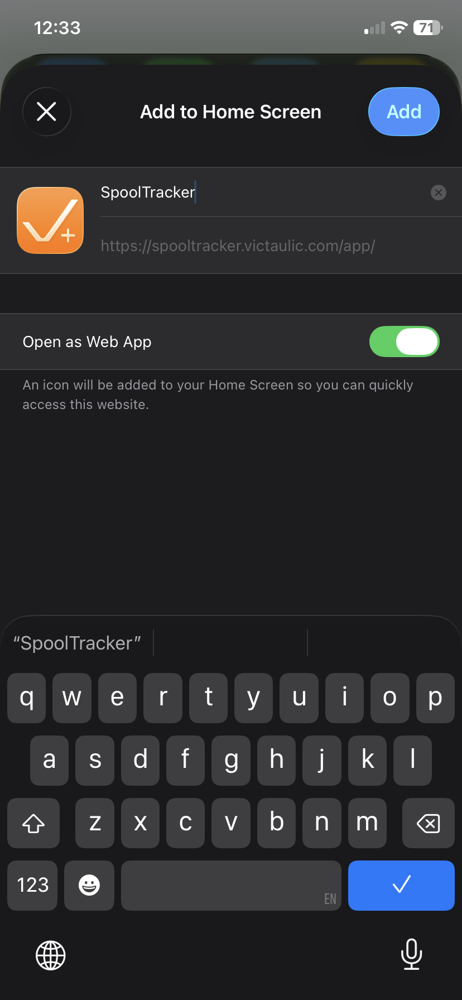

5. The Spooltracker icon will now appear on your **home screen** 🏠. Tap it to launch the app.

   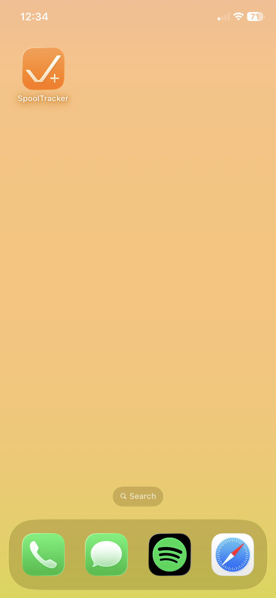

---

## Android — Chrome

1. In Chrome, Navigate to https://spooltracker.victaulic.com/app

    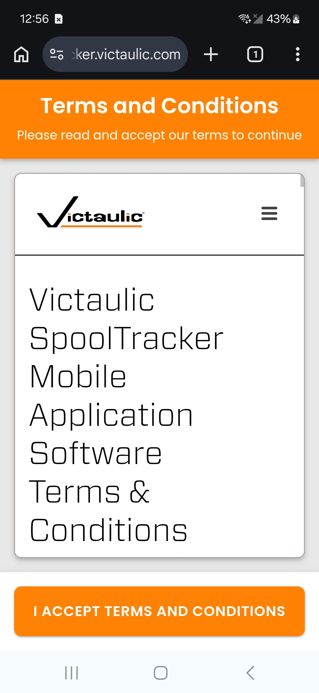

2. Tap the **menu** ⋮ button in the top-right of the address bar.

   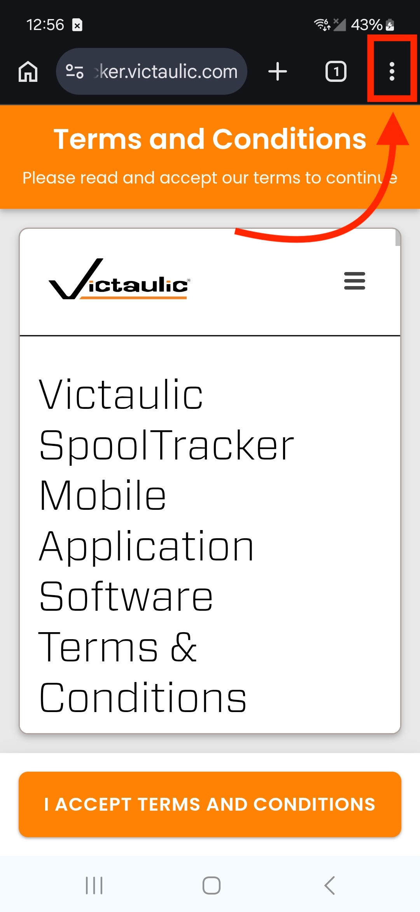

3. Tap **Install app** ⬇️ (or **Add to Home screen** ➕ on older versions).

   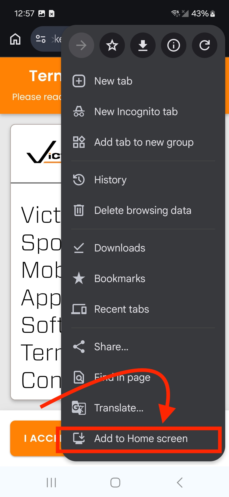

4. Tap **Install** ✓ in the popup to confirm.

   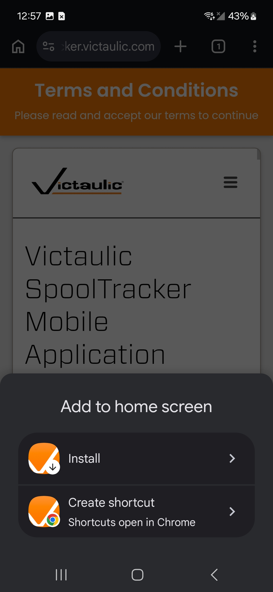

5. Tap **Install** again to confirm the installation.

    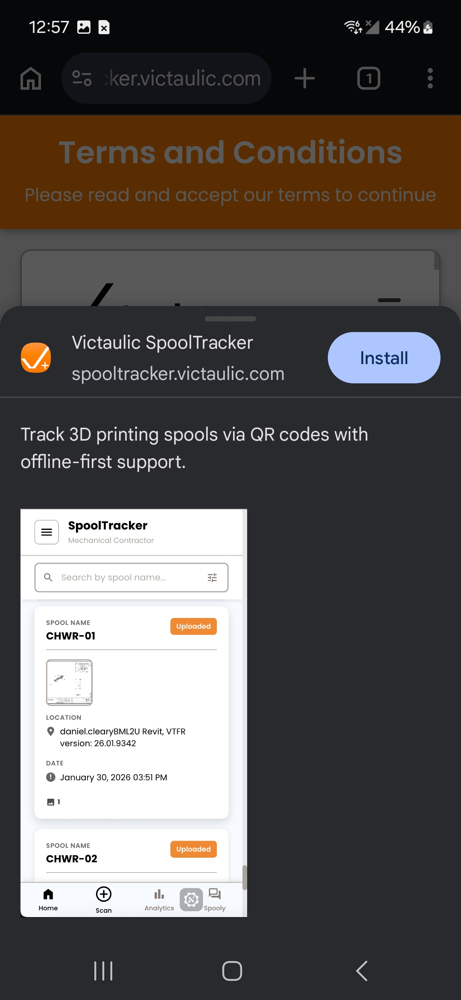

6. The Spooltracker icon will now appear on your **home screen** 🏠.

   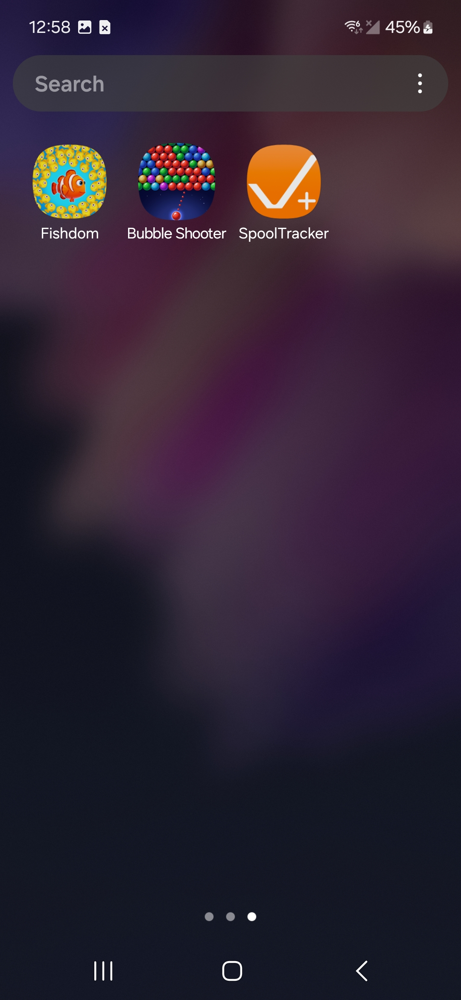

---

## Desktop — Chrome

1. Navigate to https://spooltracker.victaulic.com/app

    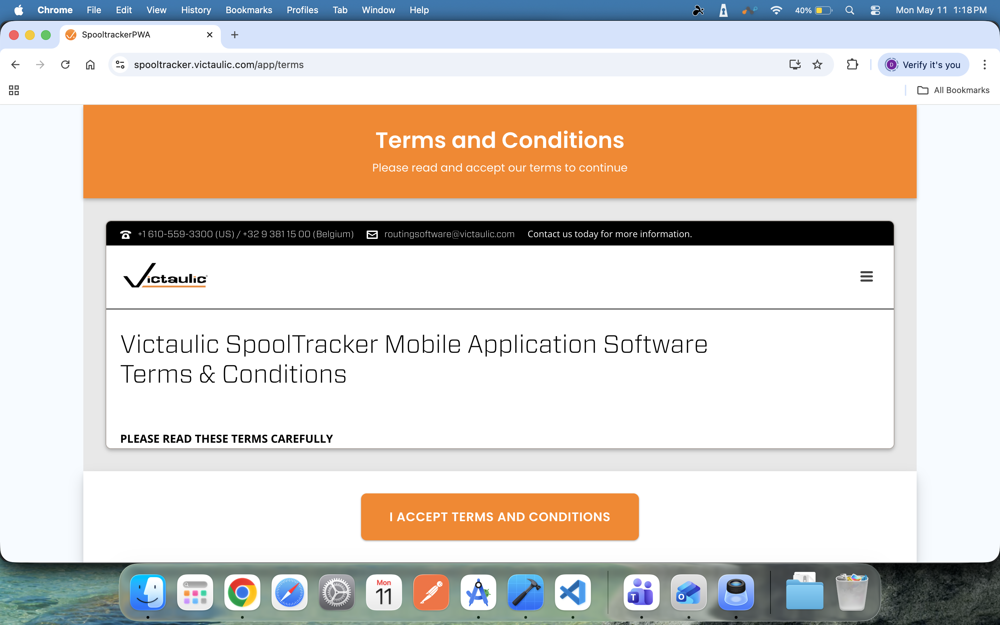

2. Click the **install** icon ⬇️ in the address bar.

   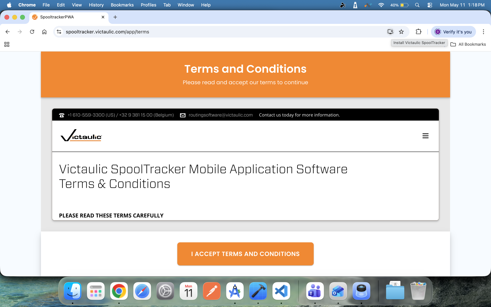

3. Click **Install** ✓ in the popup.

   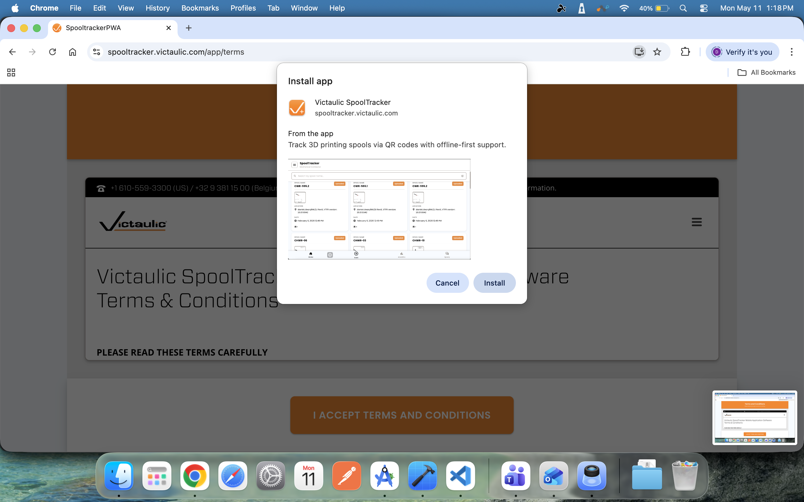

4. The app will open in its own **window** ↗️ and be available from your applications list. You may click on the icon from your desktop to quickly access the application without having to open a browser first.

   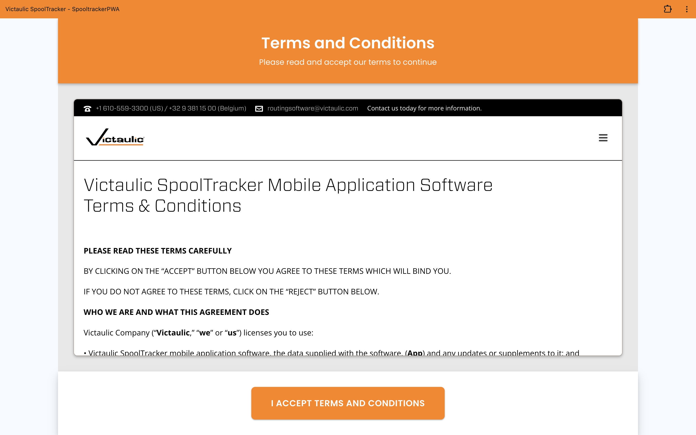

---

## After installing

Once Spooltracker is installed:

- Launch it from your home screen, Start menu, or applications folder — no need to open a browser.
- It works **offline**: scans you create without a connection are saved locally and synced automatically when you're back online.
- The app updates itself in the background. If a new version is available you'll see a "What's New" prompt the next time you open it.

## Troubleshooting

**I don't see an Install option in my browser menu.**
The page must be loaded over HTTPS and you must visit it directly (not inside an iframe). If you're on iOS, make sure you're using **Safari** — Chrome and Firefox on iOS cannot install PWAs.

**The Share button doesn't show "Add to Home Screen" on my iPhone.**
Scroll down in the share sheet — it's usually below the row of app icons. If it's still missing, edit the share sheet actions to enable it.

**I installed it but want to uninstall.**
- **iOS / Android**: long-press the app icon on your home screen and choose **Remove** or **Uninstall**.
- **Desktop**: open the app, click the **menu** ⋮ in the title bar, and choose **Uninstall Spooltracker**.

---
