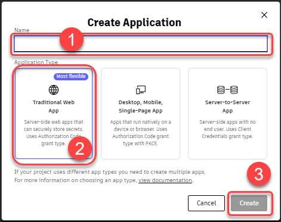
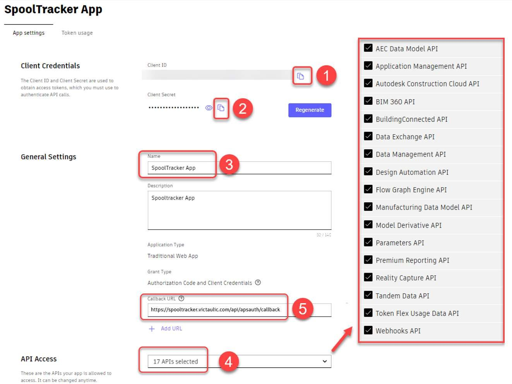
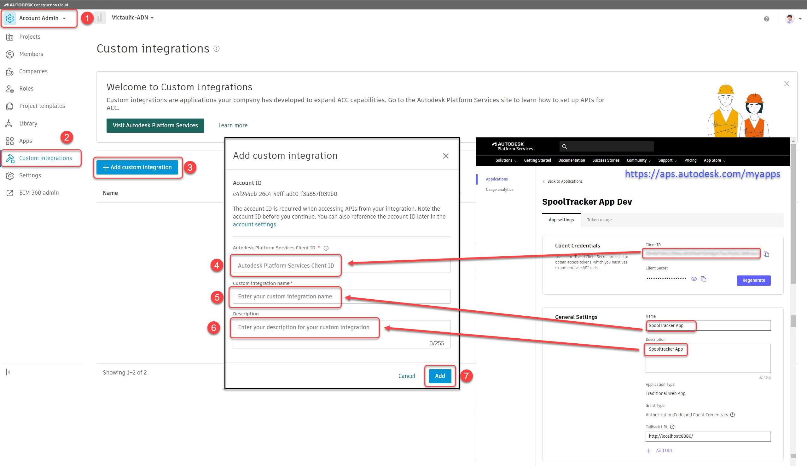
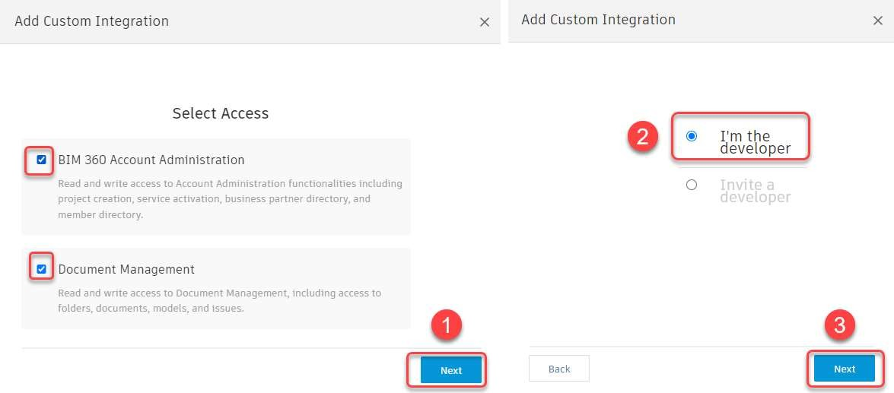
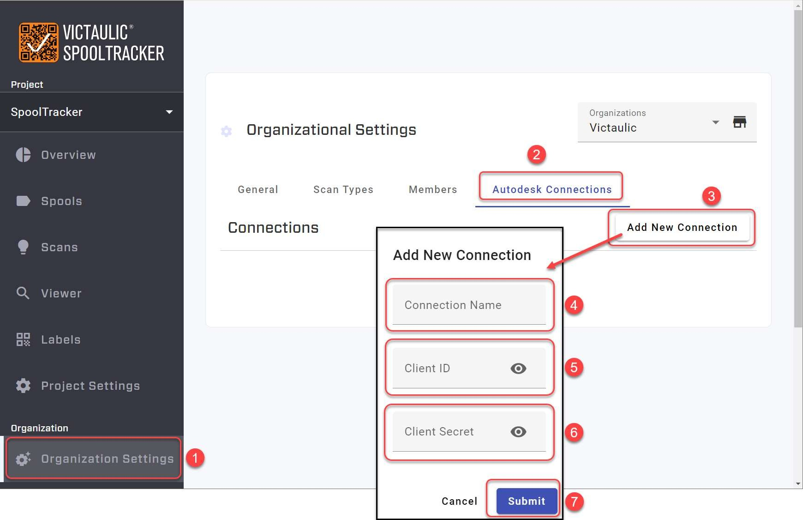

# ACC Connection Setup

## Overview

Published Views and Sheets from Revit can be viewed on the SpoolTracker Dashboard if a **Custom Integration** is created and linked to the ACC (Autodesk Construction Cloud) hub. This requires creating an application on the Autodesk Platform Services (APS) site and linking it through both ACC and the SpoolTracker Dashboard.

## Step 1: Create an APS Application

1. Visit the Autodesk Platform Services site: [https://aps.autodesk.com/myapps](https://aps.autodesk.com/myapps)
2. Create a new application with the following settings:
   - **Name:** `SpoolTracker App`
   - **Type:** Select **Traditional Web App**
3. A **Client ID** and **Client Secret** will be generated automatically. Copy these credentials for safekeeping — they are needed for the SpoolTracker connection.



## Step 2: Configure API Access

1. In your APS application settings, select the required APIs. Currently only 4 APIs are required, but it is recommended to **select all additional APIs** to support future features.
2. Set the **Callback URL** to:
   ```
   https://spooltracker.victaulic.com/api/apsauth/callback
   ```



> **Tip:** Add any other admins who may need to be aware of the connection in the **Collaborators** area at the bottom of the page. Save changes when done — changes can be made at any time via the APS link above.

## Step 3: Add Custom Integration in ACC

As an account administrator of the ACC hub, you need to add the Custom Integration.

> **Note:** ACC and BIM 360 use the same integration, so it is best to create your Custom Integration in ACC.

You will need the following from your APS application:

- **Client ID**
- **App Name**
- **Description**



If prompted with additional options during setup, select the options as shown:



## Step 4: Connect SpoolTracker to ACC

In SpoolTracker, you will need an **Organization** created by a Victaulic Administrator. As an administrator of the Organization, you can create an Autodesk Connection.

1. Navigate to the Organization settings in the SpoolTracker Dashboard.
2. Create a new Autodesk Connection with the following:
   - **Connection Name** — Any descriptive name (e.g., `SpoolTracker App` or your company/hub name if linking multiple hubs)
   - **Client ID** — From the APS site
   - **Client Secret** — From the APS site



## Verification

After completing the setup, you should see any published views and sheets in the **Viewer** and **Spools** tabs of the SpoolTracker Dashboard.

> **Note:** If views are not appearing, verify that the Custom Integration is properly configured in ACC and that the Client ID and Client Secret match between the APS application and the SpoolTracker connection.


