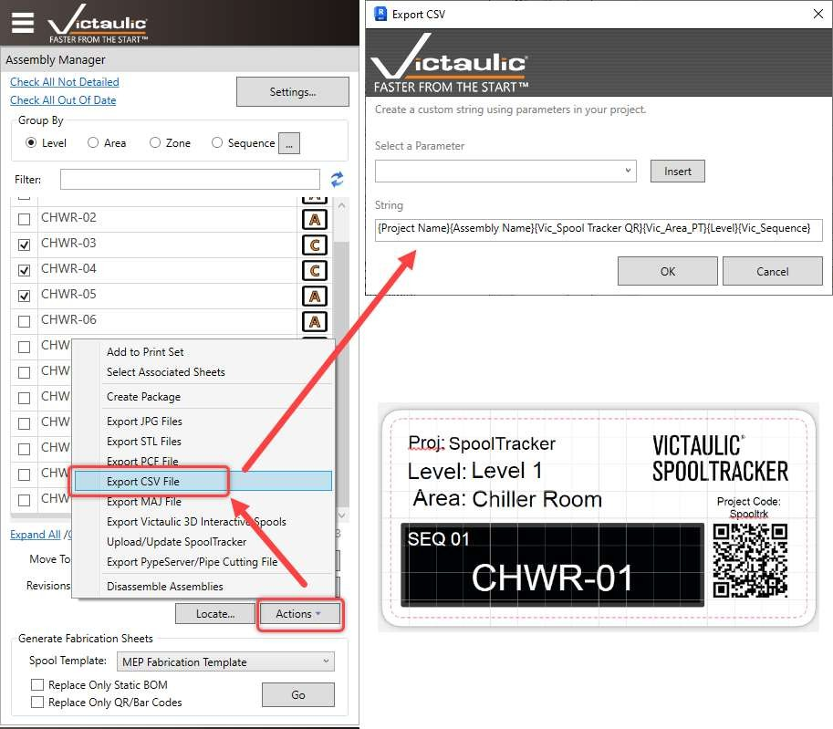

# Label Export

## Overview

To create QR code labels for spools in the fabrication shop, VTFR provides an **Export CSV File** option in the Assembly Manager. This CSV can be imported into a label printer or an online label creator to generate labels for a package or sequence.

## Exporting the CSV File

1. Open the **Assembly Manager** in the Victaulic Dock.
2. Select the spools or sequence you want to create labels for.
3. Click **Export CSV File** in the Actions dropdown.



## Creating Labels with Avery

Instead of using a dedicated label printer, you can use the Avery web-based label creator:

- **Avery Design & Print:** [https://www.avery.com/software/design-and-print/](https://www.avery.com/software/design-and-print/)
- **Pre-built Template:** [http://labe.ls/G77gQcV](http://labe.ls/G77gQcV)

Import the exported CSV file into the Avery tool and use the template to generate printable QR code labels.

## CSV String Format

The exported CSV uses the following fields:

```
{Project Name}{Assembly Name}{Vic_Spool Tracker QR}{Vic_Area_PT}{Level}{Vic_Sequence}
```

| Field | Description |
|-------|-------------|
| `Project Name` | The Revit project name |
| `Assembly Name` | The spool assembly name |
| `Vic_Spool Tracker QR` | The QR code data for the spool |
| `Vic_Area_PT` | The area parameter value |
| `Level` | The level assignment |
| `Vic_Sequence` | The sequence number |


