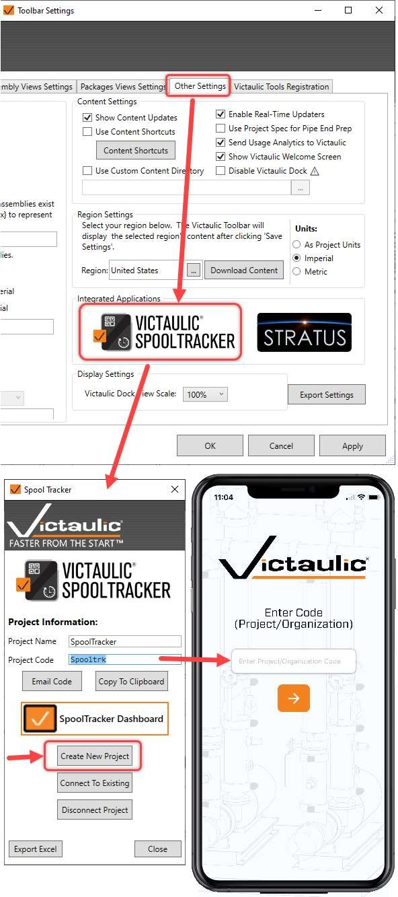
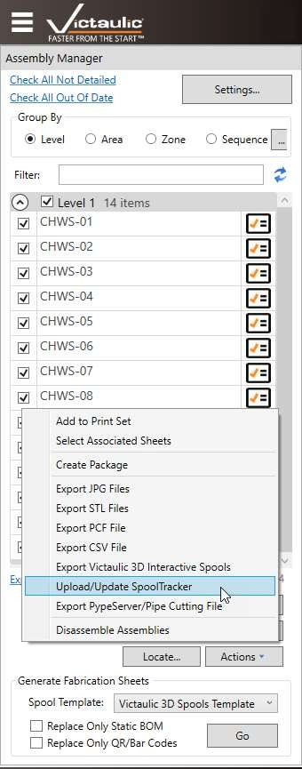

# SpoolTracker Setup in VTFR

## Overview

Spools managed by Victaulic Tools for Revit can be tracked from fabrication through installation with the SpoolTracker app. The user uploading spools will need a SpoolTracker license, available through the [Victaulic Software Store](https://www.victaulicsoftware.com/store/victaulic-spooltracker-2023/).

> **Note:** Additional support files can be found at: [https://ws.onehub.com/folders/48hrdhxf](https://ws.onehub.com/folders/48hrdhxf)

## Creating a SpoolTracker Project

1. Click the **Spool Tracker** icon located in the **Other Settings** tab of the VTFR Toolbar Settings.
2. Click **Create New Project**. A Project code will be generated.
3. Use this **Project code** to access the [mobile app](../mobile-app/getting-started.md) and the [web dashboard](../dashboard/getting-started.md).

> **Tip:** Alternatively, an **Organization code** can be created by request, and each project can be added via the web dashboard at [spooltracker.victaulic.com](https://spooltracker.victaulic.com/).

## Uploading Spools

To upload spools to the SpoolTracker project:

1. Select the spools to upload in the **Assembly Manager** of the Victaulic Dock.
2. Click **Upload/Update SpoolTracker** in the Actions dropdown.

Once uploaded, spools will be available for scanning in the mobile app and visible in the [web dashboard](../dashboard/getting-started.md).

