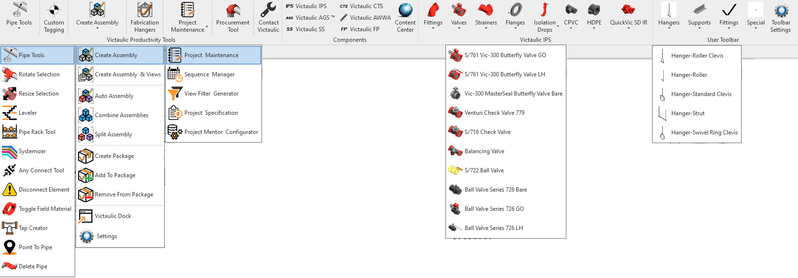

# Victaulic Tools for Revit (VTFR) User Guide

Victaulic Tools for Revit® is a set of tools that increase drawing productivity, overcome shortcomings in Revit MEP, and enable efficient BIM workflows. The toolbar can be downloaded from [www.victaulicsoftware.com](https://www.victaulicsoftware.com/).

---

## Overview

- [Introduction, Licensing & Settings Migration](overview.md) — Toolbar overview, licensing, and the settings migration tool

## Pipe Tools

Routing, layout, and editing tools for pipe, duct, conduit, and fabrication pipework.

- [Pipe / Duct Tagging](pipe-tools/tagging.md)
- [Pipe / Duct / Conduit Splitting](pipe-tools/splitting.md)
- [Rotate & Resize Selection](pipe-tools/rotate-and-resize.md)
- [Leveler](pipe-tools/leveler.md)
- [Pipe Rack Tool](pipe-tools/pipe-rack.md)
- [Systemizer](pipe-tools/systemizer.md)
- [Tap Creator](pipe-tools/tap-creator.md)
- [Point To Pipe Tool](pipe-tools/point-to-pipe.md)
- [Any Connect Tool](pipe-tools/any-connect.md)
- [Disconnect Element](pipe-tools/disconnect-element.md)
- [Toggle Field Material](pipe-tools/toggle-field-material.md)
- [Delete Pipe](pipe-tools/delete-pipe.md)
- [Selection Tool](pipe-tools/selection-tool.md)
- [Riser Tool](pipe-tools/riser-tool.md)

## Routing & Engineering

- [Caesar II® Export (Beta)](routing-and-engineering/caesar-export.md)
- [Expansion Loop](routing-and-engineering/expansion-loop.md)
- [Seismic Loop](routing-and-engineering/seismic-loop.md)
- [Auto Header Assembly](routing-and-engineering/auto-header-assembly.md)
- [Flip to Vic](routing-and-engineering/flip-to-vic.md)
- [Selection To Family](routing-and-engineering/selection-to-family.md)

## Tagging & Spooling

- [Custom Tagging](spooling/custom-tagging.md)
- [Create Assembly / Continuous Spooling](spooling/create-assembly.md)
- [Create Assembly and Views](spooling/create-assembly-and-views.md)
- [Assembly Tools](spooling/assembly-tools.md) — Auto / Combine / Split
- [Package Tools](spooling/package-tools.md) — Create / Add / Remove
- [Settings (Create Assembly Views)](spooling/settings-create-assembly-views.md)
- [Rotate Assembly](spooling/rotate-assembly.md)
- [Multi Parameters](spooling/multi-parameters.md)

## Victaulic Dock

- [Dock Overview](dock/overview.md)
- [Assembly Manager](dock/assembly-manager.md)
- [Package Manager](dock/package-manager.md)
- [Component Bank](dock/component-bank.md)
- [Project Mentor & Configurator](dock/project-mentor.md)

## Procurement & Hangers

- [Procurement Tool](procurement-and-hangers/procurement-tool.md)
- [Fabrication Hangers](procurement-and-hangers/fabrication-hangers.md)
- [Hanger Snap Tool](procurement-and-hangers/hanger-snap-tool.md)
- [Update Hangers](procurement-and-hangers/update-hangers.md)
- [Family Update Tool](procurement-and-hangers/family-update-tool.md)

## Settings

- [Other Settings](settings/other-settings.md) — Procurement / Spool, Content, Third Party
- [Victaulic Cloud Settings](settings/cloud-settings.md)
- [Project Maintenance](settings/project-maintenance.md)

## SpoolTracker Integration

- [SpoolTracker App Integration](spooltracker-integration/app-integration.md)
- [SpoolTracker Dashboard](spooltracker-integration/dashboard.md)
- [SpoolTracker ACC® Connection](spooltracker-integration/acc-connection.md)

> **See also:** the [SpoolTracker integration guide](../spooltracker/vtfr-integration/spooltracker-setup.md) for the SpoolTracker-focused walkthrough.

## Workflow Tools

- [Sequence Manager](workflow-tools/sequence-manager.md)
- [View Filter Generator](workflow-tools/view-filter-generator.md)
- [Project Specification Tool](workflow-tools/project-specification-tool.md)

## Components Ribbon

- [Content Center](components-ribbon/content-center.md)
- [Content Visibility](components-ribbon/content-visibility.md)
- [Update Available](components-ribbon/update-available.md)

## Important Information

- [Parameters, web access, and FAQs](important-information.md)
