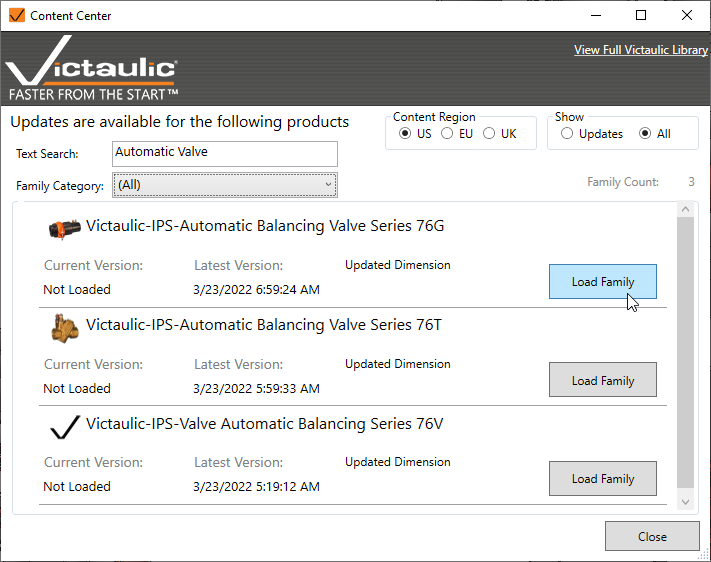
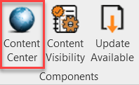

# Content Center

The **Content Center** is a direct link between the Revit® model and an online library of Revit families. The tool can be used to search and load or update any Revit® families managed by the library.

There is a mode that filters to **Out of Date** content and lets the user update all old content.

