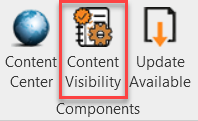
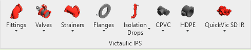
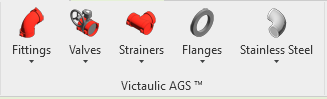
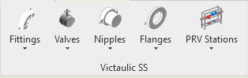
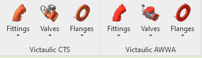

# Content Visibility

Click **Content Visibility** and select checkboxes to show or hide the corresponding product ribbons. Selecting the required fitting or accessory automatically loads the family if it does not already exist in the project.

> **Note:** Existing families will not be overwritten. Certain families (like valves and taps) will be ready to be placed in the run of pipe.

You may continue to select products from the ribbon as they are required in your pipe system, eliminating the need to search the project browser for the correct family.

> **Hidden Feature:** If you select multiple elements in the project and then select a family from the component ribbon, the families of the same type will change to the selected family.

