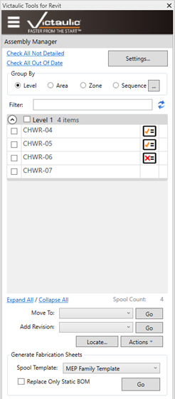
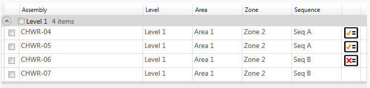
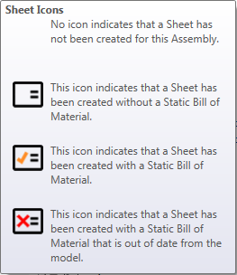
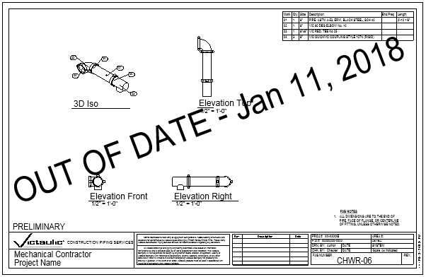

# Assembly Manager

The **Assembly Manager** is a tool for organizing, processing, revisioning, and printing assembly sheets. As assemblies are created and detailed, the list and status of each assembly is updated. Detailed assembly sheets can be accessed by clicking the icon on the right side of the list.

Use the **Generate Fabrication Sheets** section at the bottom to create views and sheets based on the [Settings (Create Assembly Views)](../spooling/settings-create-assembly-views.md).

## Grouping & Organization

Use the **Group By** toggles to group assemblies by **Level**, **Area**, **Zone**, or **Sequence**. This is useful when processing sheets for specific sections or levels. Each section can be expanded and collapsed — especially valuable for larger projects with many assemblies.

## Move To

Using the **Move To** tool at the bottom, assemblies can be updated and organized by writing specific parameter values to the elements and the assembly. Reference Levels can be adjusted using this tool without moving or disconnecting elements.

## Revisions

Revisions can be added to multiple sheets at once using the **Add Revision** section.

## Locate

Use the **Locate** button to highlight the components in your model that are members of the selected spools.

## Actions

In the **Actions** menu, you'll find printing options, package options, and various file exports of assemblies.

## Inline Field Editing

Expanding the dockable window's width makes more fields available. With the exception of Level, typing into these fields applies that parameter data to the elements and the assembly itself — a fast way to manage parameter data of all assemblies and components.

## Sheet Status Icons

Each sheet icon has a different meaning, determined by the status of the **Static Bill of Material**. Refer to the [Settings (Create Assembly Views)](../spooling/settings-create-assembly-views.md) for further explanation on customizing and placing the Static Bill of Material.

For assemblies that use the Static Bill of Material, the Assembly Manager is aware of dimensional and parameter changes that happen in the model. If the assembly is moved or certain parameters are updated, the icon changes from the orange Victaulic V to a red X. This notifies the user to update the Static Bill of Material for that assembly.

## Updating Out-of-Date BOMs

There are tools in the Assembly Manager to assist:

- At the top is a **Check All Out of Date** button. Click this and then use the **Replace Only Static BOM** option while generating Fabrication Sheets to update all out-of-date Static BOMs.

> **Tip:** The Victaulic Project Template includes a sheet that takes advantage of this Static BOM Status — preventing a sheet from being issued with an incorrect bill of material.
