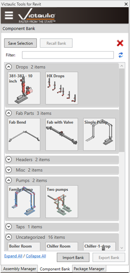

# Component Bank

The **Component Bank** is a tool designed to expedite the placement of components in your model. A selection-based bank can be created to store a typical combination of piping components and recalled in a different project.

Being a database-driven tool, measurements have been put in place to prevent conflicts between families, pipe types, materials, and systems.

Banks can be stored, exported, and shared with other Victaulic Tools for Revit users via zip files.

## Save a Component Bank

1. Make a selection of piping components in your model.
2. Click the **Save Selection** button in the Component Bank.
3. Assign a name to your new bank.

## Recall a Component Bank

1. Click the icon for the bank within the Victaulic Dock.
2. Click **Recall Bank**.

In a **2D View**, placement can be done with a single click inside the view.

In a **3D View**, select a plane within the view (a floor, a concrete pad, or anything flat). This tells the tool which level the Component Bank should be associated with. Then click where you'd like the bank to be placed.

> **Note:** There is no limit to the number of Component Banks you can have loaded. Use the filter at the top to find specific banks. Component Banks are available in any project, but the associated elements aren't loaded until a bank is placed in your model.
