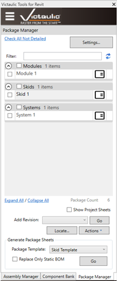
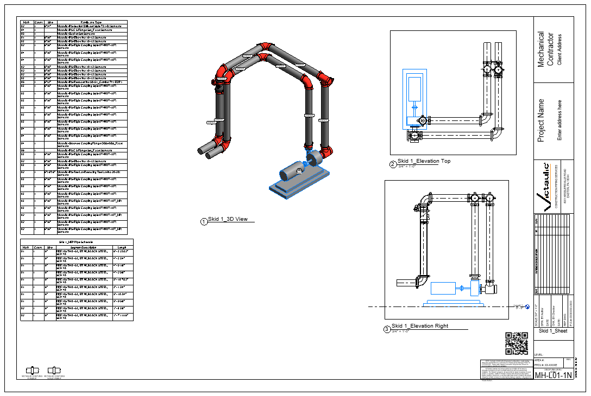

# Package Manager

Using the same familiar workflow as the [Assembly Manager](assembly-manager.md), use the **Package Manager** to manage larger selections of components. These selections can contain assembled and non-assembled parts and can be created from the Actions menu of the Assembly Manager or by using the [Create Package](../spooling/package-tools.md) icon in the Victaulic Tools toolbar.

## Categories & View Settings

Organize Packages into categories and use Package View Settings to control how Package Sheets are created. Use the **Generate Package Sheets** section at the bottom to create views and sheets based on the configured settings.

## Show Project Sheets

Use the **Show Project Sheets** option to show all sheets in your project. The sheet icons can then be used to navigate between project sheets.

## Revisions

Revisions can be added to multiple sheets at once — including project sheets — using the **Add Revision** section.

## Locate

Use the **Locate** button to highlight the components in your model that are members of the selected packages.

## Actions

In the **Actions** menu, you'll find printing options, package options, and various file exports of packages.
