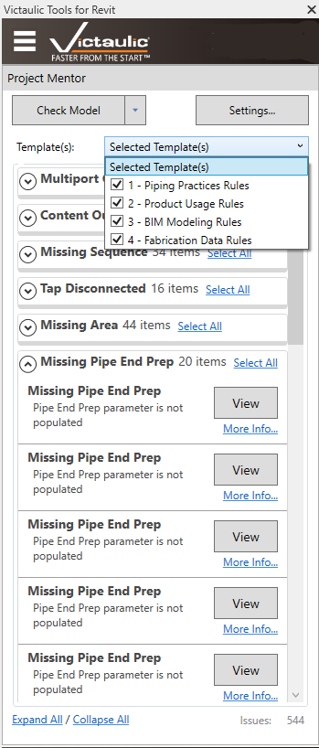
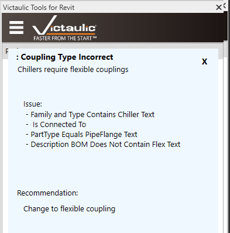
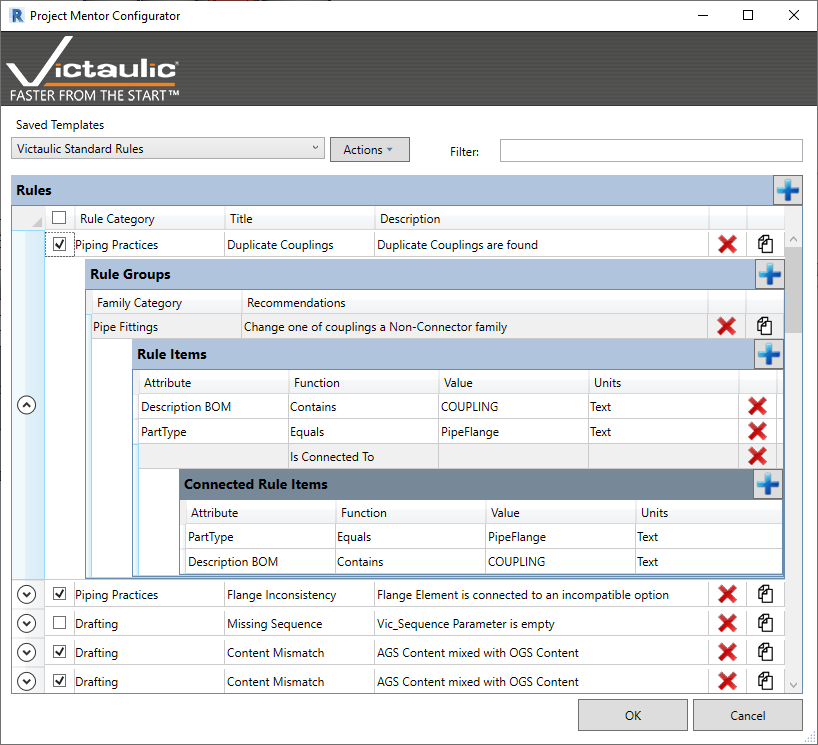

# Project Mentor & Configurator

## Project Mentor

The **Project Mentor** is a user-programmable tool that checks any Revit model for specific attributes — and combinations of attributes among connected components — to alert the user of potential issues.

## Running Model Checks

Templates can be managed and shared using the [Project Mentor Configurator](#project-mentor-configurator).

- Use the **Check Model** button to check your model against templates selected with checkboxes.
- Alternatively, use the arrow to the right and select **Run All Templates** to check your model against all saved templates.

Both options can be run on an entire project or just a selection. If your selection is empty, the command runs on the entire model. Otherwise, it runs only on your selection.

## Reviewing Exceptions

Exceptions to Project Mentor rules are grouped and counted, with controls to expand and collapse all groupings.

- The **View** button for each rule locates the element causing the exception. An appropriate view is found and zoomed in to show the element.
- The **More Info…** button displays the exception details — the component name, the issue rules used to find the component, and a recommendation for how to avoid this issue.

## Project Mentor Configurator

The **Project Mentor Configurator** lets the user configure custom rules specific to their project or organization. The Configurator is accessed through the settings button in Project Mentor.

Each **Rule** contains **Groups** for each Family Category to check. Each Group contains **Rule Items**, and each Rule Item can contain **Connected Rule Items** to check for connected items with specific attributes.

## Templates

Project Mentor Templates can be configured using the **Actions** menu. Selected rules can be imported and exported, as well as entire templates. Use the exported file to back up your rules or share with another Victaulic Tools for Revit user. Use the filter at the top to quickly find a rule to edit.
