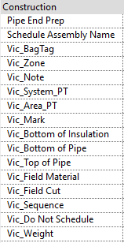
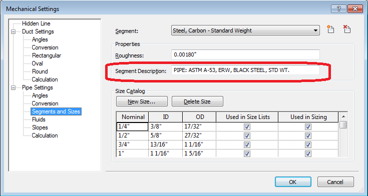
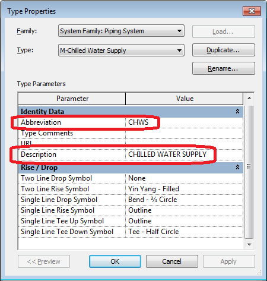

# Important Information

## Parameters

Victaulic Tools for Revit creates multiple shared parameters within any project. By default, if the parameters already exist they will **not** be overwritten — data will be pushed to the existing parameters.

## Pipe Descriptions

Pipe descriptions are found under **Mechanical Settings (MS) → Segments and Sizes → Segment Description**.

## Systems

System abbreviations and descriptions are found under **Piping Systems** in the Project Browser.

## Web Access Requirements

For VTFR to access families, settings, Pipe Types, and licensing, web access must be present. Some web filters block this access. Specifically, end users need access to the **victaulic.com** and **victaulicsoftware.com** domains.

To test access, use this link:

- [https://www.victaulicsoftware.com/version_queryapprovals.php](https://www.victaulicsoftware.com/version_queryapprovals.php)
