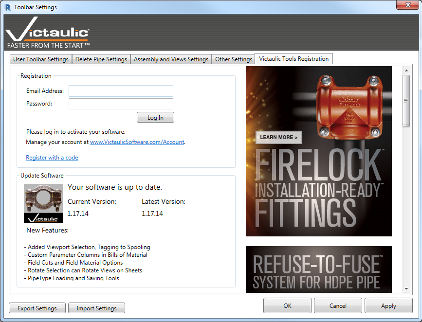
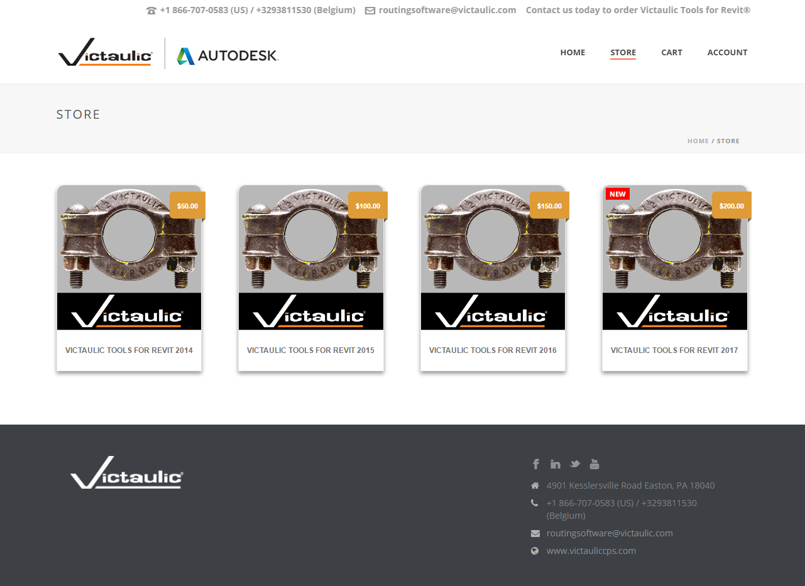
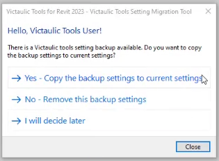

# Introduction, Licensing & Settings Migration

## Introduction to Victaulic Tools for Revit®

Victaulic has created a set of tools for Revit® that increase drawing productivity, overcome shortcomings in Revit MEP, and let you do BIM efficiently.

The tools can be downloaded from [www.victaulicsoftware.com](https://www.victaulicsoftware.com/).

## Licensing

After downloading your 30-day free trial of Victaulic Tools for Revit, a **Register Victaulic Tools** button appears in the Revit ribbon. Licenses can be purchased from [www.victaulicsoftware.com/store](https://www.victaulicsoftware.com/Store/).

Once purchased, register the software with the email address and password from the store. Multiple installations can be licensed using the same email and password combination. Once licensed, the **Register Victaulic Tools** button no longer appears.

  
  

## Settings Migration Tool

Each time the toolbar is reinstalled or updated, the user is prompted with options to keep their old settings (by copying the backup settings) or restore to defaults (by removing the backup settings).

