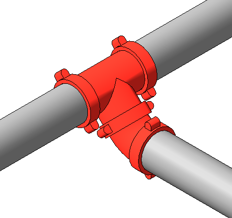
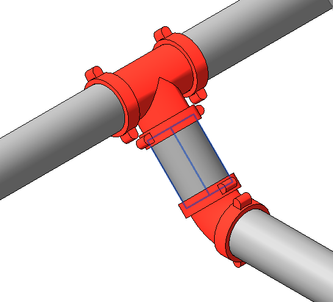
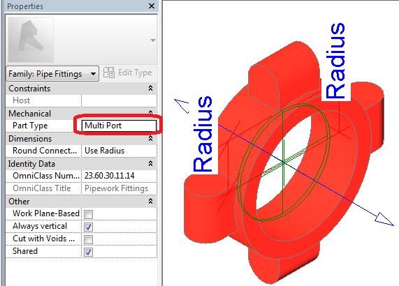
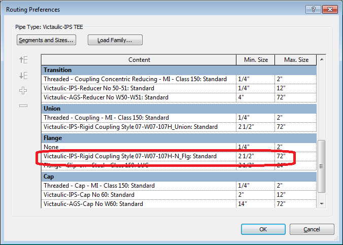
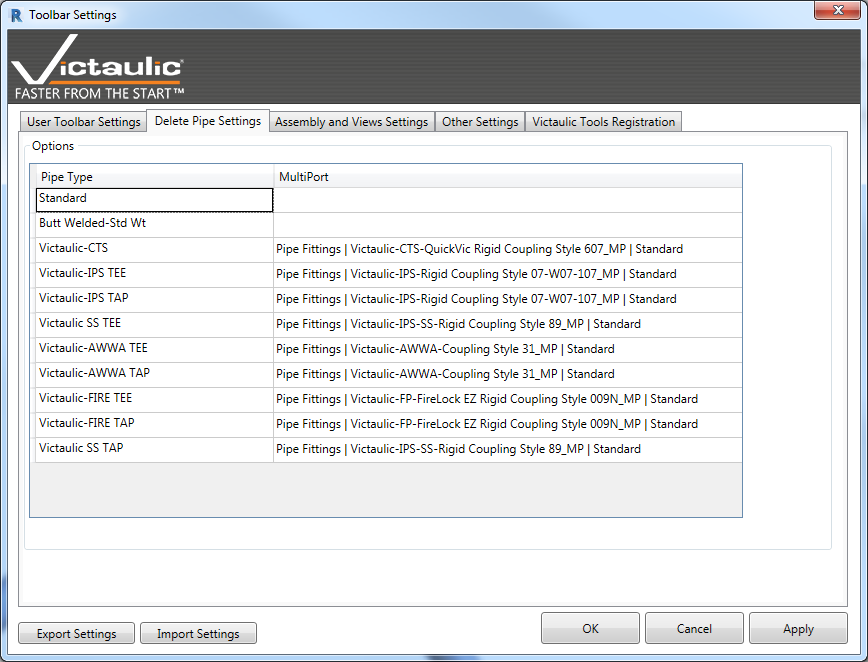

# Delete Pipe

Deletes the selected pipe and connects the families fitting-to-fitting, keeping your piping system properly connected.

Click the **Delete Pipe** button on your toolbar. Select the end of pipe you want the fittings to move towards. The pipe is deleted and a multiport family is placed according to the Delete Pipe Settings per pipe type.

  
  

## Delete Pipe Settings

The **Delete Pipe Settings** button is where you define what (if any) family is placed between fittings or accessories when you delete pipe.

If you do not specify a flange in your pipe type **Routing Preferences**, you don't need to set a multiport fitting in the Delete Pipe Settings.

We have found that changing the coupling family to the **Flange** part type and specifying it in the pipe type Routing Preferences enables placement of a coupling at each connection (as a flanged system would in Revit). With a flange set, deleting pipe between accessories will also delete the flange families.

For this reason, we have also created **Multi Port** part type couplings — Multi Port pipe fitting families will not automatically be deleted between accessories when piping is changed.

The Delete Pipe tool will automatically place these multiport fittings when needed. Multiport families are typically named with `_MP`.

There is also a lookup-table-based system for specifying pipe fittings to use while going fitting-to-fitting. Certain pipe types will not require a setting.

> **Note:** The defaults are based on the Victaulic Project Template, available for free from Victaulic.
