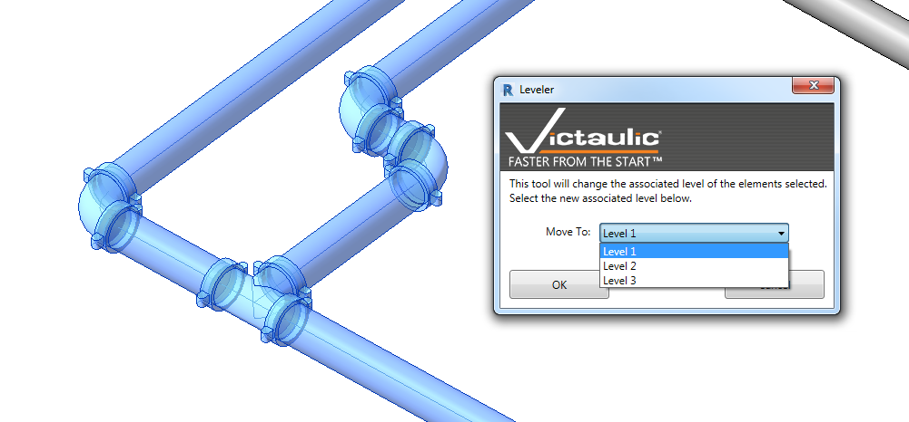

# Leveler

The **Leveler** is a selection-based tool to fix the associated reference level of elements in your project. It corrects the reference level of each element without moving it or losing connectivity.

Select the items you want to change and run the **Leveler** tool. Choose the new reference level and click **OK**. The items will be referenced to the new level while retaining connectivity and their position in your model.

