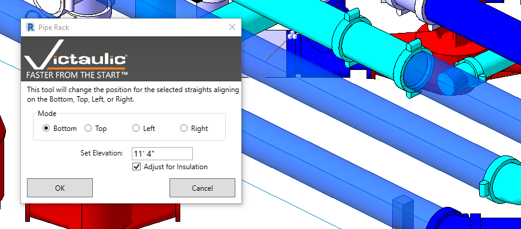

# Pipe Rack Tool

The **Pipe Rack Tool** is a selection-based tool that aligns horizontal Pipe, Duct, Conduit, and Fabrication Pipe by bottom elevation, top elevation, and left or right orientations. Taking insulation into account, this tool can expedite alignment of multiple trades that share the same supports.

To use the Pipe Rack Tool:

1. Select one or any combination of horizontal pipes, duct, conduit, or fabrication pipe in your project.
2. Select the mode to align the straights.
3. Choose an elevation for your selection (Bottom or Top only) and click **OK**.

Straights in your selection will all be set to a consistent alignment, adjusting for size and insulation.

