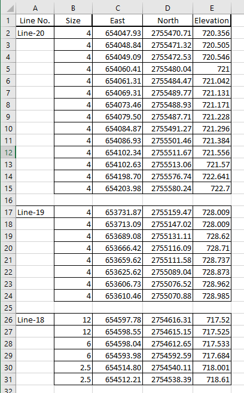
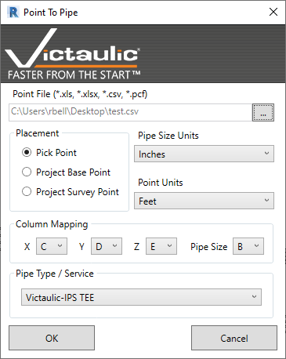
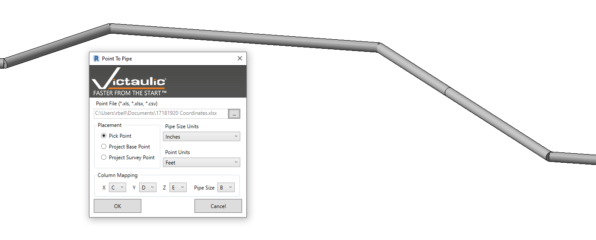

# Point To Pipe Tool

The **Point To Pipe Tool** expedites the creation of pipe that may fall at odd angles and elevations. Specify the coordinates of pipe lengths in a spreadsheet, or use a PCF file from any other drafting software. The tool uses these coordinates to create the pipe in Revit.

Revit, like many other 3D modeling software, uses an XYZ coordinate system to specify the position and length of straights. When pipe must be tilted in one or all planes, drawing it can be a challenge.

## Using the Tool

1. Acquire the coordinates of the desired pipe lengths and enter them into an Excel spreadsheet, or acquire a PCF file from any popular drafting software.
2. Open the **Point To Pipe** tool in a 3D or Plan view of your drawing and select the spreadsheet for input.
3. Specify the units used in the spreadsheet for **Pipe Size** and **Points**.
4. Choose where the tool should place the newly created pipe — using **Pick Point**, **Project Base Point**, or **Project Survey Point**.
5. Map the **X (Northing)**, **Y (Easting)**, **Z (Elevation)**, and **Pipe Size** to the appropriate columns in the source spreadsheet.
6. Select the **Pipe Type** or **Fabrication Service** to use and click **OK**.
7. If using **Pick Point**, select the point where the pipe should be based in your drawing.

