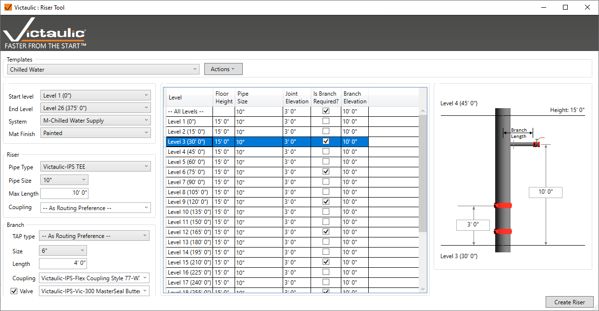

# Riser Tool

Create a piping riser based on a template-driven menu using project levels and heights to populate branch locations and fitting makeup.

1. Select a template, or create a new riser by selecting the starting and ending level.
2. Customize the modeling preferences with the various options available.
3. Click **Create Riser**, then click on a point that would be in line with the main riser pipe.

