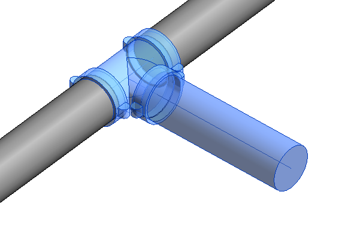
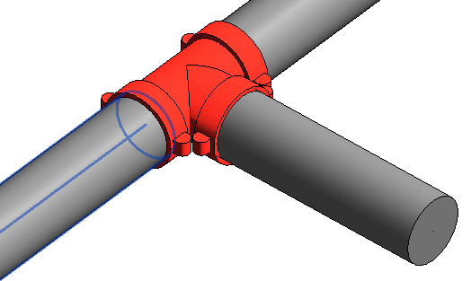
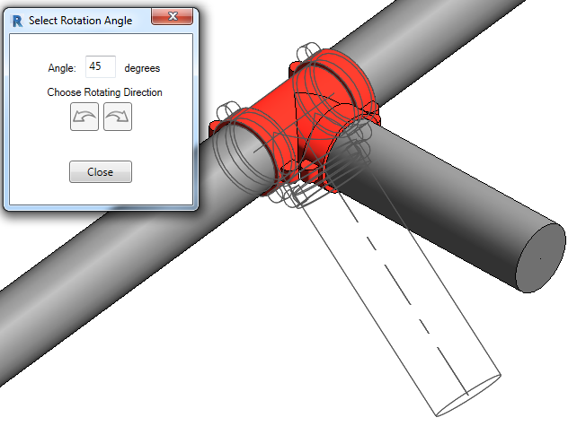
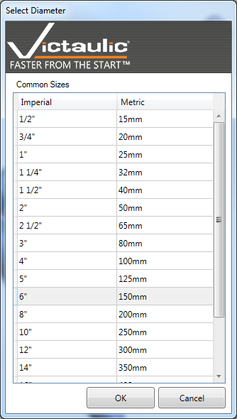
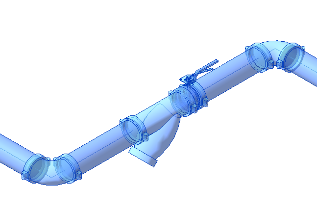
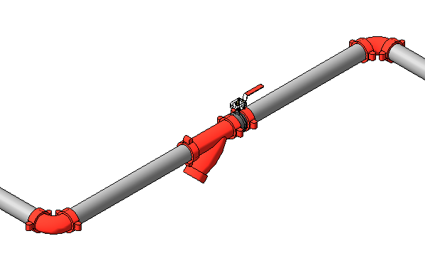

# Rotate & Resize Selection

## Rotate Selection

Select the families you want to rotate, then click the **Rotate Selection** button. Click a pipe, coupling, or weld to define the axis of rotation. The **Select Rotation Angle** window appears — specify the angle and watch your selection rotate.

This tool is useful when you need to route pipe from a header at an angle.

  
  

## Resize Selection

Select the fittings and accessories you want to resize and click the **Resize Selection** button. The current size will be highlighted. Choose the desired size from the list and click **Change Size**.

  
  

