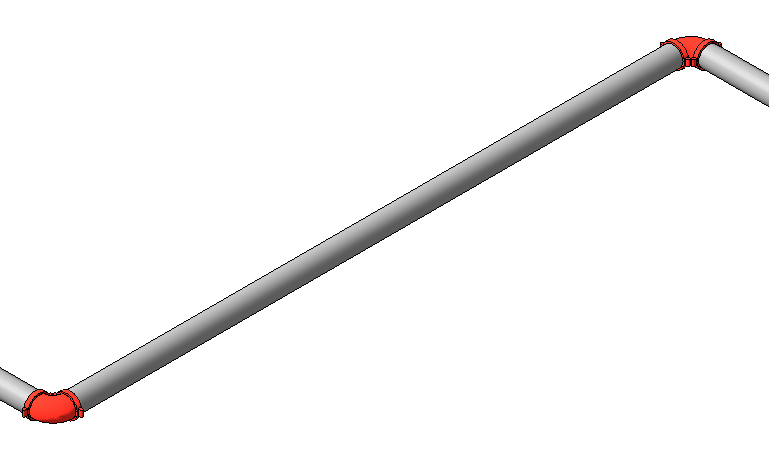
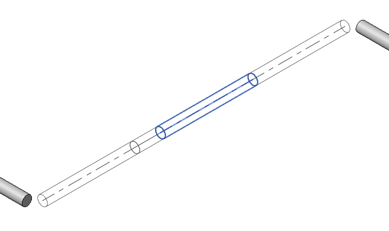
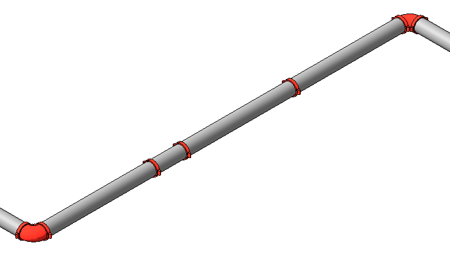
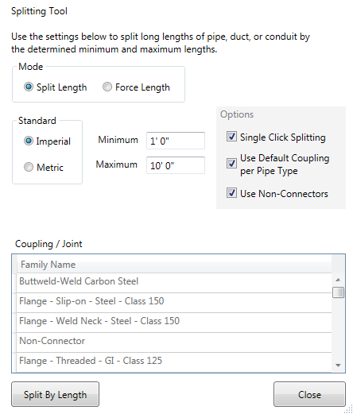

# Pipe / Duct / Conduit Splitting

When routing in Revit®, pipe and duct lengths are not cut into commercially available lengths. The **Pipe Tools → Split Pipe / Duct** button cuts pipe or duct at predetermined lengths. The minimum length will prevent cuts that are difficult to groove.

After clicking **Pipe Tools** in the ribbon, the **Pipe / Duct Length** window appears. Be aware that lengths are in feet or millimeters.

Uncheck **Use Default Coupling** to choose a specific coupling between pipe segments.

The **Use Non-Connectors** check box is only used when couplings are specified as flanges in the pipe type. A Non-Connector family is automatically loaded.

## Single Click Splitting

**Single Click Splitting** lets the user split an entire length of pipe or duct with a single click. Pipe and duct start splitting from the end where the mouse pointer is located.

## Force Length Mode

**Force Length** mode can be used to set a specific length for existing pipes. Set the desired length and each pipe you click will be set exactly to that length.

These splitting and force-length tools work with all pipe types, conduit, duct, and fabrication pipework.

