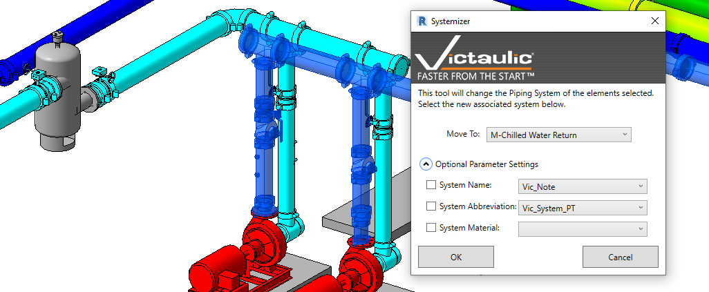

# Systemizer

The **Systemizer** is a selection-based tool to set piping systems. It automates and simplifies setting piping systems by allowing the user to force a piping system upon their selection. It also creates piping systems on items that do not have a system set.

To use the Systemizer:

1. Select one or any combination of pipes, duct, or fabrication pipe in your project.
2. Choose a system for your selection and click **OK**.

> **Tip:** Optionally specify system information to be written to parameters on the selection. This helps organize and visualize your model by piping system.

