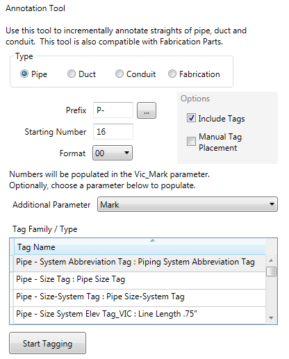
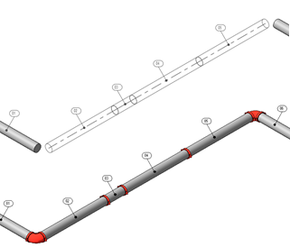

# Pipe / Duct Tagging

Select the **Pipe Tools** button in the ribbon to display the **Pipe Tagging** window. You can define a prefix, starting number, and the format of the tag numbers. Check **Include Tags** to also place a pipe tag annotation.

In the list, specify which **Pipe Tag** annotation family from your project to place.

The **Vic Mark** shared parameter is created and populated with an auto-incrementing number as you select pipes in order. Your annotation family must use this shared parameter for the tag to receive Vic Mark values.

Select the pipes in the order you want them tagged.

