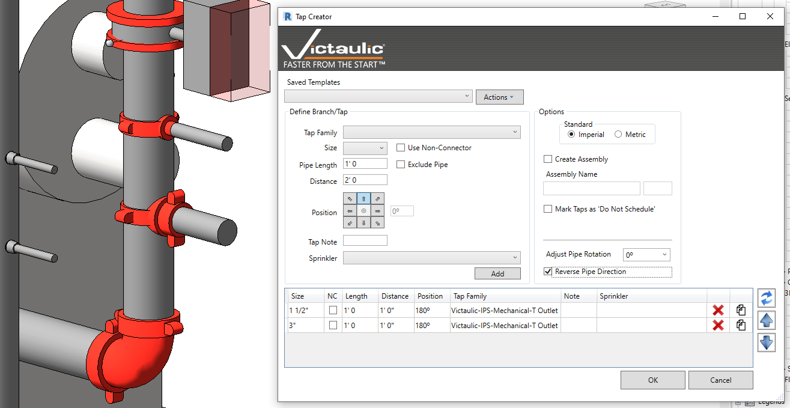

# Tap Creator

The **Tap Creator** is a database-driven tool to create tap connections off of pipe. Historically, tap placement has involved section and elevation views and multiple Pipe Types for correct family placement.

Whether you're placing small diameter outlets on a vertical pipe or large branches off a header, the Tap Creator places any Tap family on any Pipe Type.

To use the Tap Creator:

1. Select one or multiple pipes in your project.
2. Select the tap family, size, length, distance, and position of the tap.
3. Optionally, specify a note to be applied to the **Vic Note** parameter, and/or specify a sprinkler head to be placed at the end of the new pipe.
4. Edit the lines in the table to make any updates to your configuration. A preview of your changes is available in your original view.
5. Use the **Templates** section to save what you've created.

> **Tip:** Additional tools are available to create an Assembly from your newly created taps, mark tap families as **Do Not Schedule**, and reverse or adjust the main pipe's rotation.
