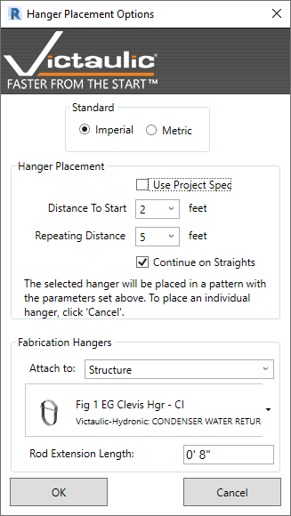

# Fabrication Hangers

The **Fabrication Hanger** tool is a placement tool for MEP Fabrication Hangers that lets you place an array of hangers on MEP Fabrication Pipework. You can specify the **starting** and **repeating** distance, plus attachment options.

## Two Ways to Run the Tool

### No Selection

Run the tool with no Fabrication Hangers selected, and you'll be prompted to select a Fabrication Pipe Length. Choose lengths, placement options, hanger style, and attachment options. Each Fabrication Pipe length within the same system selected thereafter will get hangers placed.

### With Existing Hangers Selected

Select Fabrication Hangers previously placed in the model and run the tool. Use the **Fabrication hangers** section at the bottom to switch hanger style, attachment options, and Rod Extension Length.
