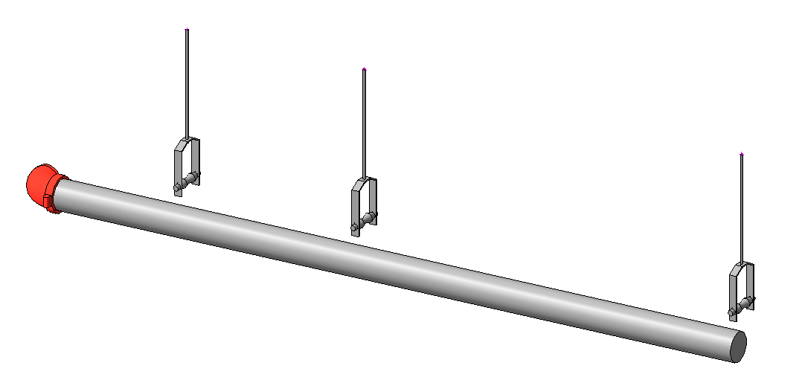
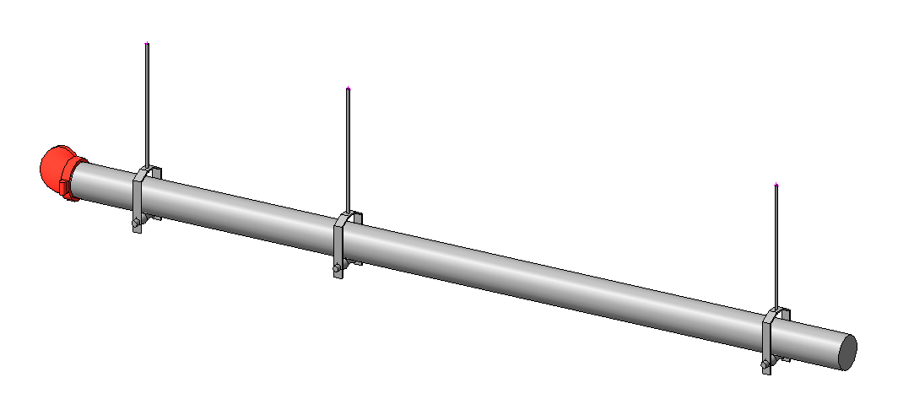

# Hanger Snap Tool

With Revit family hangers, there is no connection or association between the pipe and hanger. When reconfiguring piping systems, the hanger is often left in space.

The **Hanger Snap Tool** reassociates and moves hangers to the correct locations on moved or new piping systems while retaining and updating hanger family data.

  
  

## Using the Tool

1. Select the misplaced hangers.
2. Click the **Hanger Snap Tool**.
3. Click the destination pipe length.

Hangers snap onto the pipe at the closest point along the pipe length.
