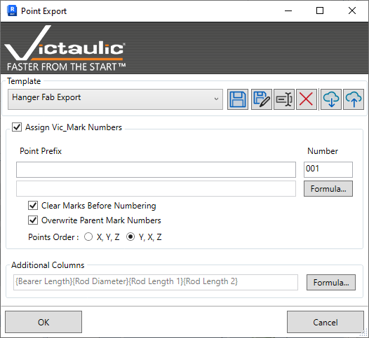
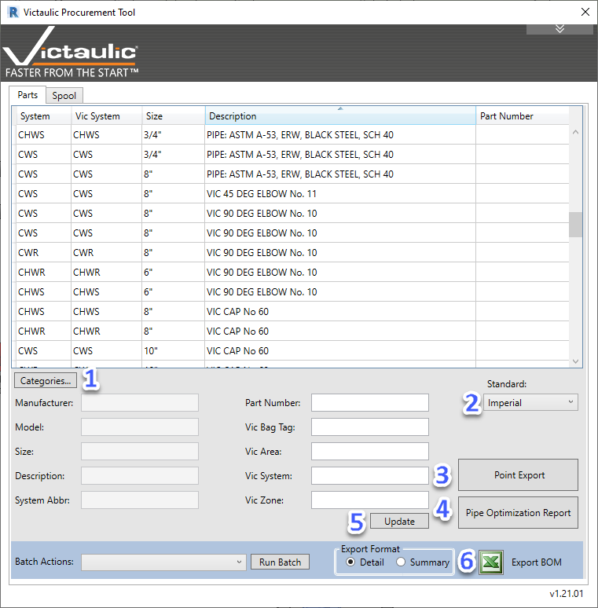
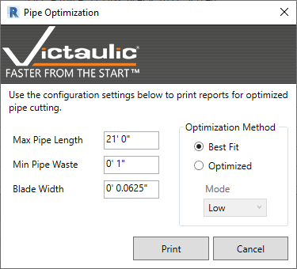
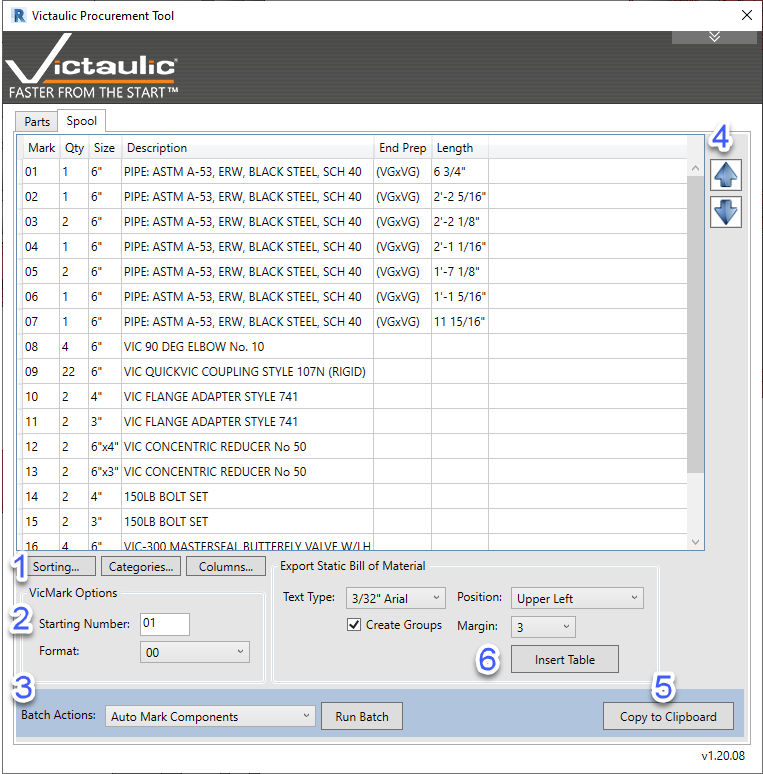
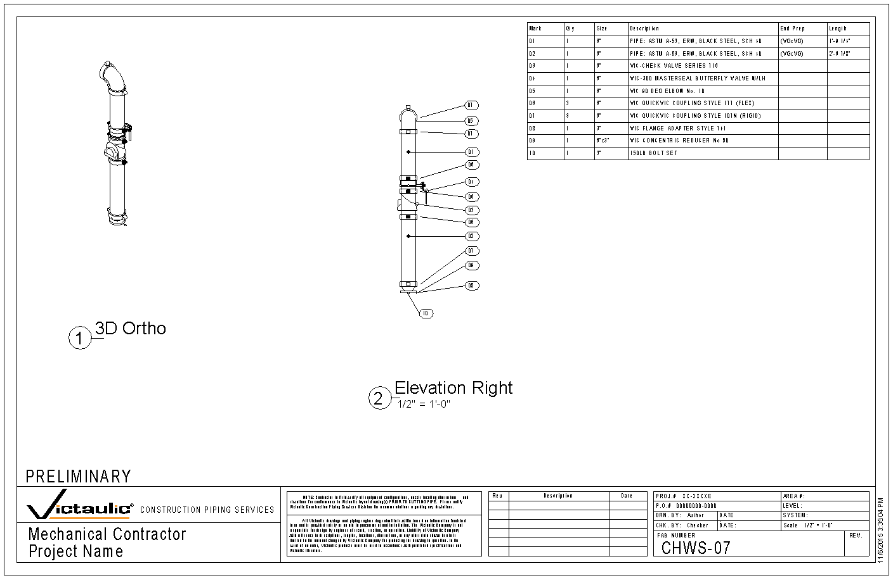
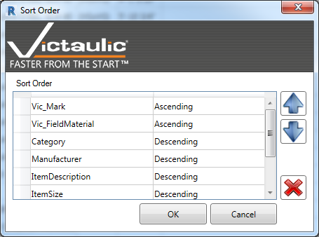
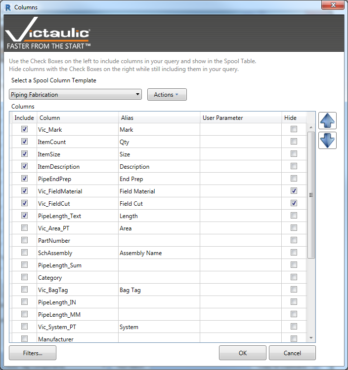
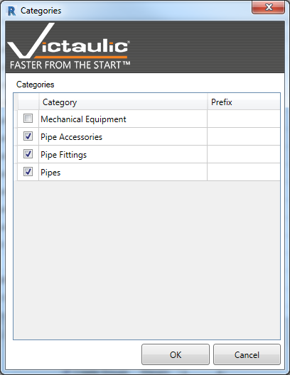

# Procurement Tool

The **Procurement Tool** is a selection-based bill-of-material tool. Inside Revit, the only way to create a material list is via schedules filtered on parameters assigned to the families in the project. The Procurement Tool lets you window-select families for a simple, selection-based bill of material.

To use it, select the families you want in the bill of material and click the **Procurement Tool** button. Always use a 3D view so you don't accidentally miss accessories in the vertical.

There are two tabs: **Parts** and **Spool**.

## Parts Tab

1. **Categories** — Further filter your selection by category.

   

2. **Standard** — Adjust to view items in Imperial or Metric sizes and lengths.

3. **Mark Numbering** — Multiple formats of point families can be read and their locations exported to CSV. Mark numbering methods can include variable parameters and static text.

   

4. **HTML Report** — An HTML report can be generated with accurate pipe length estimates and an efficient method of cutting to minimize material waste. **Target pipe length**, **blade width**, and **minimum waste** can be adjusted to improve accuracy.

   

5. **Parameter Writing** — Victaulic parameters can be written to directly from the Procurement Tool for selected items in the table.

6. **Export BOM** — Select a format and export a CSV from your selection using the **Export BOM** button.

## Spool Tab

The **Spool** tab is used for creating fast bills of material on selections of piping within assemblies and 3D views.

1. **Sorting / Categories / Columns** — Set your sorting, categories, and columns using the buttons (see [Customizing the BOM](#customizing-the-bom) below).
2. **Vic Mark numbering format** — All tags use the `Vic Mark` parameter under the **Construction** group.
3. **Auto Mark Components / Clear Mark** — Both batch actions only modify selected lines above. With no lines selected, they run on the entire list. This enables renumbering specific areas of the material list.
4. **Reorder** — When a line is selected you can reorder the material list as needed. **Auto Mark Components** follows the order of items in the list.
5. **Copy to Clipboard** — Select all lines and click **Copy to Clipboard**. Paste as text in a text box within your sheet — the formatting is readable when pasted in a text box. Use a fixed-width text font for best results.
6. **Insert Table** — Select the Text Type, Position, and Margin for your Bill of Material, then click **Insert Table** to place a table-formatted bill of material in your view or sheet.

## Customizing the BOM

**Sorting, Categories, and Columns** allow you to customize the look of your bills of material.

### Sort Order

To change the sort order, select the left side then use the up / down arrows to move. Sorting priority starts with the first record then moves down.

### Categories

**Categories** lets you filter the selection by specific Revit family categories. You can also set a prefix for `Vic_Mark` tagging (e.g., `P-`, `F-`, `PA-`).

### Columns

The **Columns** window provides a list of predefined columns to add or remove from your bill of material. Column order can be changed using the up / down arrows. Customize or create your own **Spool Column Templates** to customize your Static Bill of Material.

