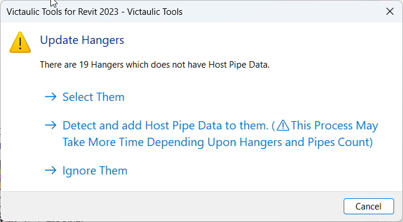

# Update Hangers

This tool reassociates hangers to their host elements (e.g., pipes) when changes occur in the host element's location or parameters. Family hangers can lose their connection to pipes, leading to them being left behind when pipes are moved.

The **Update Hangers** tool ensures hangers stay correctly associated with their host elements, updating their position and construction parameters.

## Using the Tool

1. Select **Update Hangers** under the Fabrication Hanger dropdown ribbon.
2. A notification window appears if any hangers do not have host data — informing you that some hangers are not associated with their host element.
3. If you move a host pipe, click the **Update Hangers** button.

The tool automatically reassociates and moves the hangers to match the updated location of the host pipe, ensuring they are positioned correctly.

## Parameters Updated

The following parameters are also updated when using the tool:

- Insulation Thickness
- `Vic_BagTag`
- `Vic_Zone`
- `Vic_System_PT`
- `Vic_Area_PT`
- `Vic_Sequence`
- Pipe Size
- Nominal Diameter
- CL Elevation

> **Tip:** If needed, use the [Hanger Snap Tool](hanger-snap-tool.md) to manually associate a hanger with its host pipe. This is helpful when hangers aren't automatically recognized by the Update Hangers tool, or additional fine-tuning is required.
