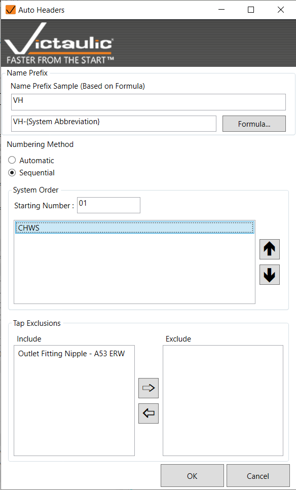
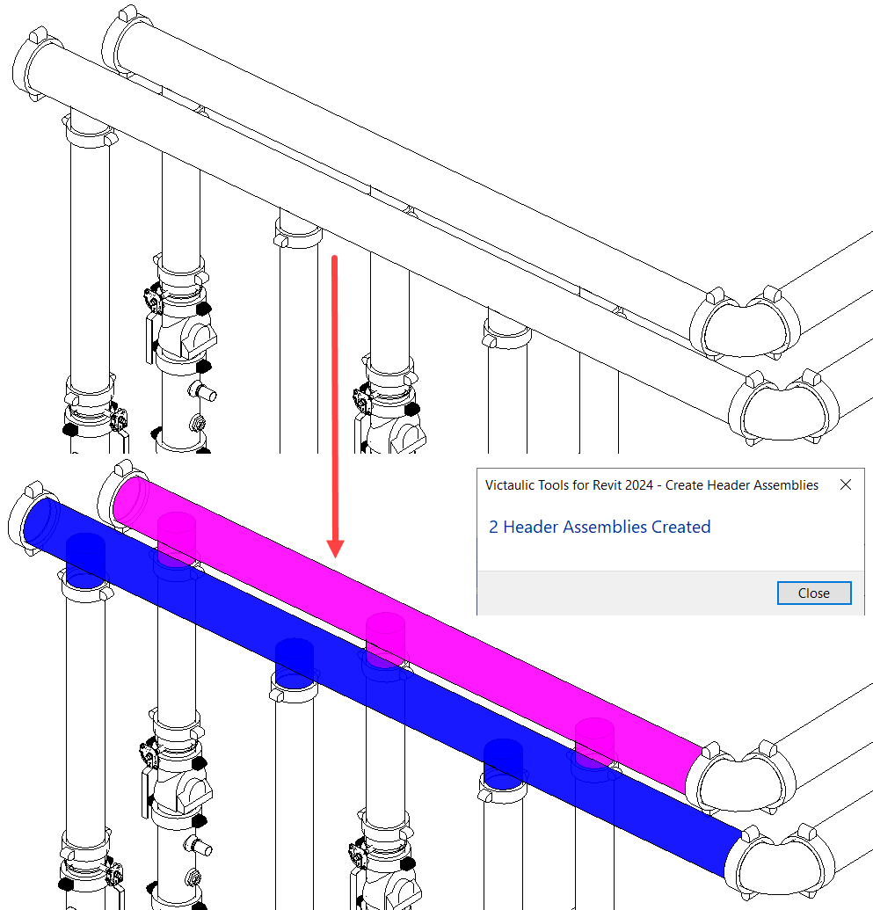

# Auto Header Assembly

Select a model and create assemblies for all pipes that have a tap. Exclusive for Revit families.

In the **Auto Header** window, you can:

- Define assembly naming logic
- Set the numbering method
- Set system numbering order
- Exclude specific small taps from creating an assembly

This tool allows users to create Victaulic Outlet Fittings No 26 and prioritize large assemblies in the shop.

