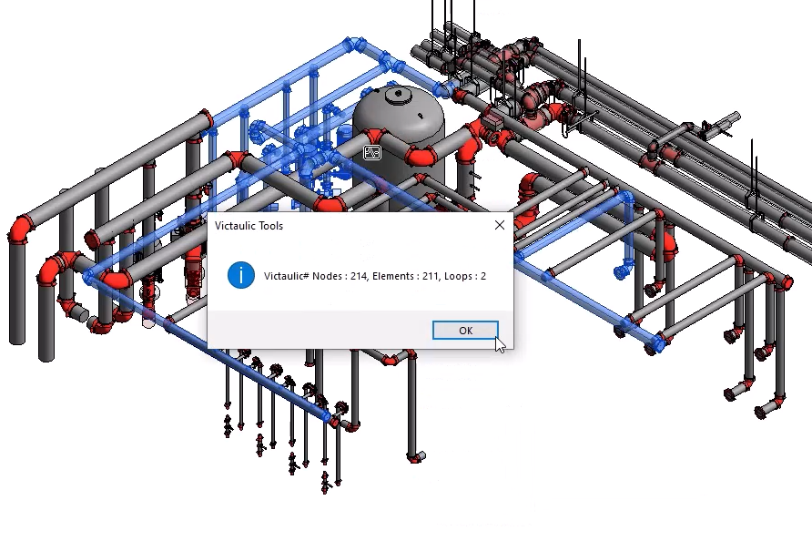
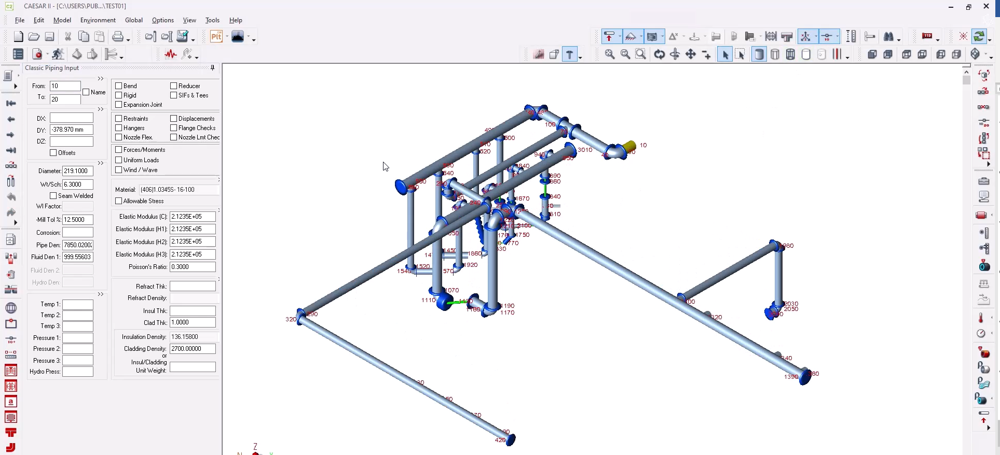

# Caesar II® Export — Beta

This tool helps select piping systems to be exported to Caesar II®.

> **Note:** This is a new tool. Please verify any exported data — if you find issues with the export, use the **Contact Victaulic** button on the VTFR ribbon.

## Exporting from Revit

1. Select the piping system in Revit.
2. Click **Caesar II® Export** under the Pipe Tools category.
3. A pop-up appears indicating the number of Elements / Loops / Nodes being exported.
4. Save the export file.

## Importing into Caesar II®

1. Open Caesar II®.
2. Choose **File → Caesar II® Neutral file**.
3. Browse to the saved exported file. Click **Convert**.
4. Once converted, click **Open** and browse to the file location.
5. Click **Piping Input** and the file will open in Caesar II®.

