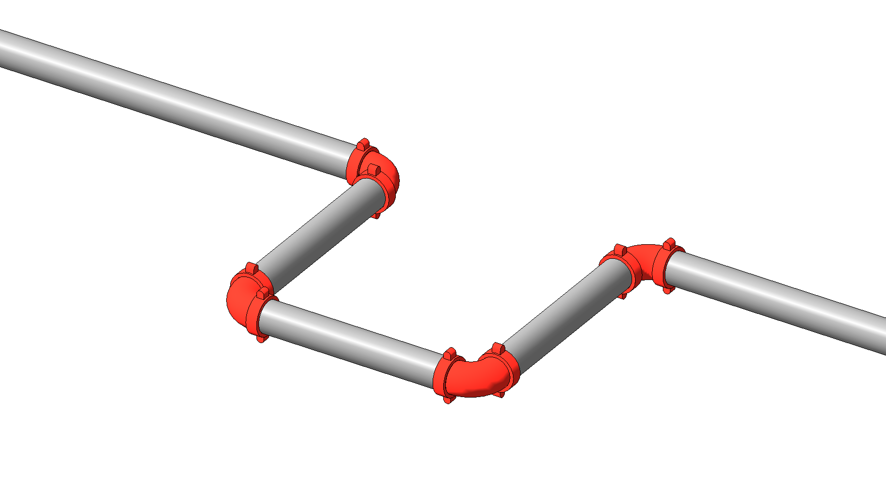

# Expansion Loop

Creates an offset piping loop by clicking two points on a pipe. The first click indicates the direction of the loop.

> **Tip:** More flexibility can be added with flex couplings through the Content Ribbon.
