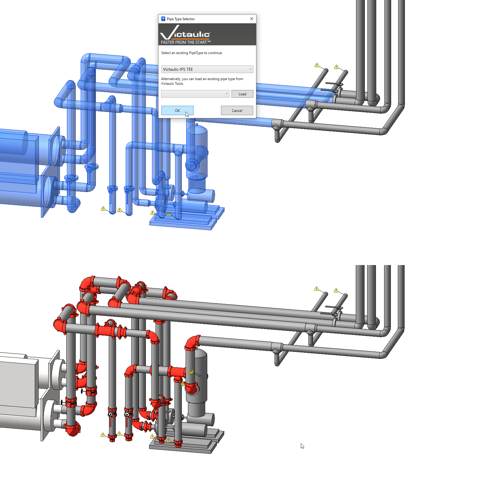
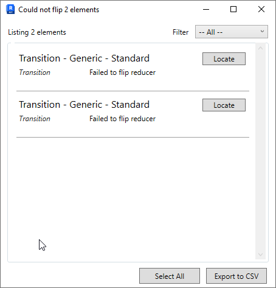
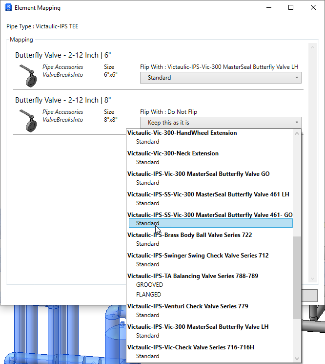

# Flip to Vic

**Flip To Vic** lets the user flip pipe joining methods and materials quickly and easily within a Revit® model.

During the flip, the tool does **not** move pipe locations or equipment. It disconnects those elements rather than force them. The [Any Connect Tool](../pipe-tools/any-connect.md) can be used to move and reconnect components.

## Using Flip to Vic

1. Select any pipes, fittings, and accessories.
2. Click **Flip to Vic** in the **Modify** tab.
3. Select a loaded Victaulic pipetype.
4. Click **OK**.

A window will pop up if accessories were included in the selection. Use it to indicate how (or if) accessories should also be flipped.

A window will pop up if the tool was unable to flip every component. Clicking **Yes** opens a different window that can be used to locate each component, or to export a CSV with the Revit® IDs of each component.

