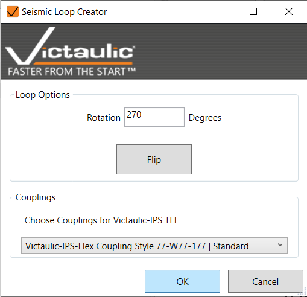
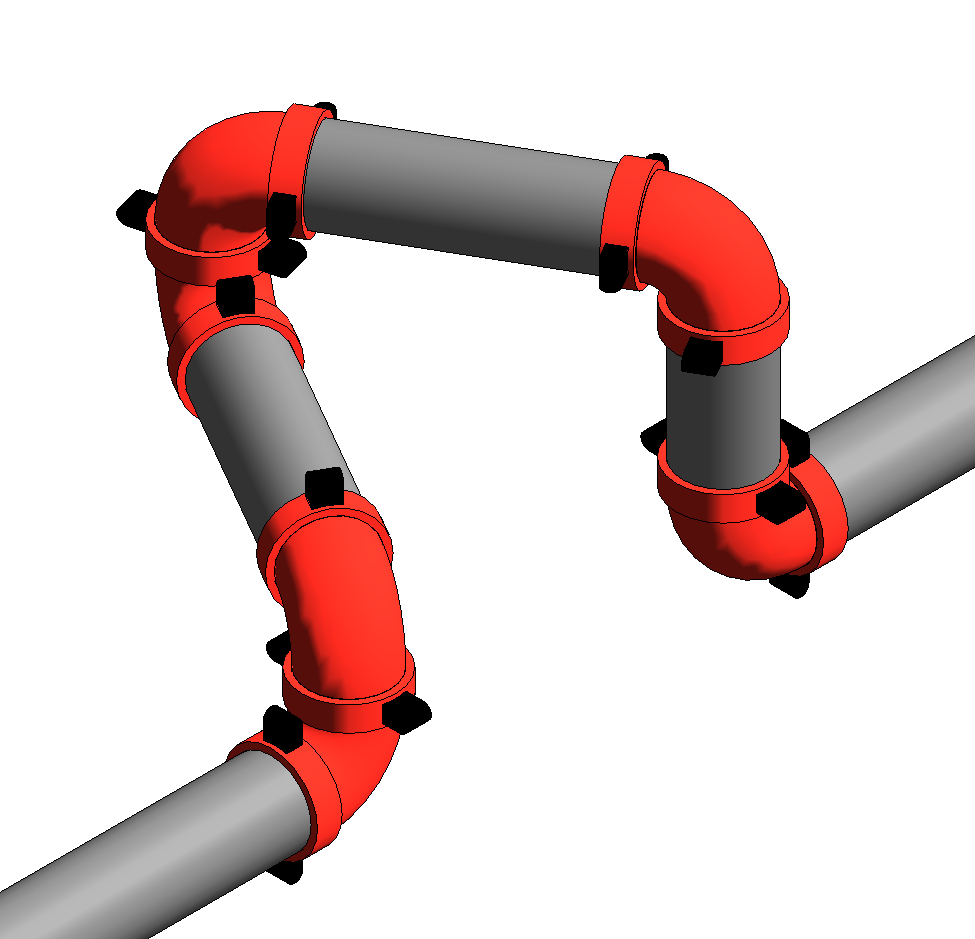

# Seismic Loop

Model a Victaulic seismic joint with just a few clicks. Exclusive for Revit families.

Select a location on a run of pipe to set the location for the seismic loop. In the popup window, set the rotation and couplings to be placed at each joint. Click **OK** and the seismic loop is modeled.

