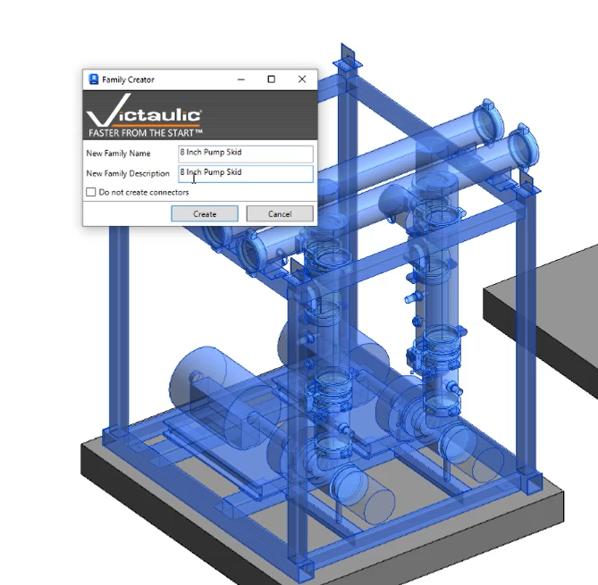
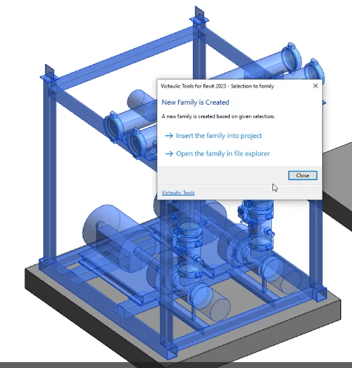

# Selection To Family

This tool creates a Victaulic family from a selection of families. The user can create a family by selecting multiple existing elements in their Revit project.

## Using the Tool

1. Navigate to either a 2D or 3D view in your Revit project.
2. Select the elements you want to convert into a family. For example, you might select a Pump Skid (as shown), pipes, fittings, or other components.
3. Click **Selection to Family** from the Victaulic Tools ribbon.
4. In the configuration window, fill in the required information:
   - **New Family Name** — A unique name for the family
   - **New Family Description** — A brief description
   - If needed, check the box to **not create connectors**; otherwise leave it unchecked if connectors are required.
5. Click **Create** to generate the family.

A confirmation pop-up offers two options:

- **Insert the family into project** — Places the newly created family directly into your active project.
- **Open the family in file explorer** — Opens the family in Windows Explorer so you can save or manage it externally.

> **Important:** If you are working in a 2D view, the tool creates a 2D family. In a 3D view, it creates a 3D family.
