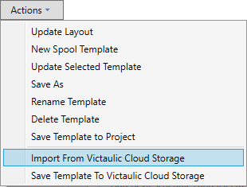
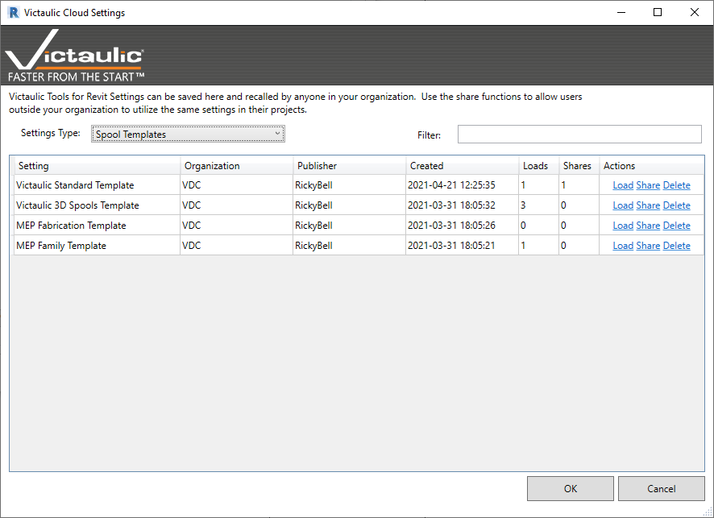
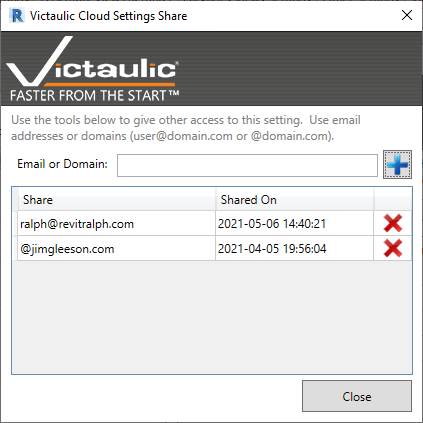

# Victaulic Cloud Settings

Throughout Victaulic Tools, there are areas where users can save settings as Templates and Presets. Previously these were managed by importing and exporting settings files.

With **Victaulic Cloud Settings**, users can save, share, and recall settings for numerous Victaulic Tools in one place.

## Saving and Recalling Templates

Each **Actions** menu has options to **Import Settings from Victaulic Cloud Storage** and **Save Templates to Victaulic Cloud Storage**.

To save a template, find one you'd like to save and click **Actions → Save Template To Victaulic Cloud Storage**.

To import, click **Actions → Import From Victaulic Cloud Storage**, locate the template you'd like to recall, and click the **Load** option on the right-hand side.

## Sharing Settings

Find the setting you'd like to share and click the **Share** option on the right-hand side. In the resulting screen, type the user's organization email address to share with a specific user.

> **Note:** This is the email address used to purchase and register their Victaulic Tools for Revit installation.

> **Tip:** Optionally, share the setting file with an entire domain by entering just the `@` sign and the user's domain. Anyone on that domain with an active Victaulic Tools account will see the setting available to download.
