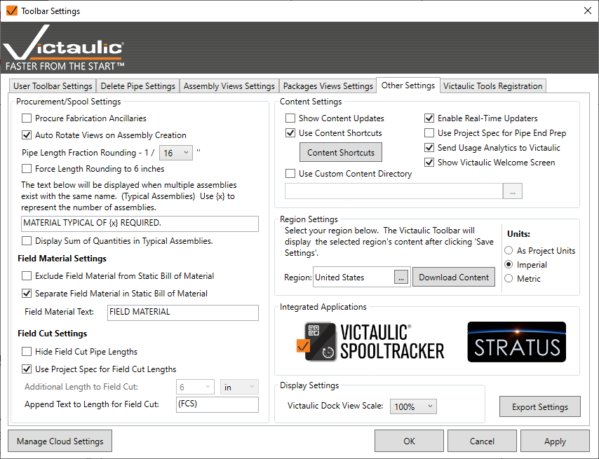

# Other Settings

Additional settings further customize the software to fit your business needs. The settings on the left affect the [Procurement Tool](../procurement-and-hangers/procurement-tool.md) and Static Bill of Materials on spool sheets. The settings on the right determine how you acquire content and content updates.

## Procurement / Spool Settings

- **Procure Fabrication Ancillaries** — Fabrication Ancillary data is not easily visible within Revit and not available to be scheduled with standard Revit tools. This option adds the additional ancillary data to the Procurement task and displays these items in your Static Bill of Material.

- **Auto Rotate Views on Assembly Creation** — Piping is not often drawn aligned to project north. With this option, the software rotates the components in assembly views to appear as level and aligned as possible.

- **Pipe Length Fraction Rounding** — Applies only to Imperial measuring units on Pipe Length. Typically a fabrication shop won't go more accurate than 1/8", while some go to 1/16".

- **Typical Assemblies** — Depending on your customer's needs, you may want to create one spool drawing to represent multiple groups of components. While placing the Static Bill of Material, this can be noted. If more than one instance of this assembly exists, this text will be inserted at the bottom of the table.

- **Display Sum of Quantities in Typical Assemblies** — Displays the total number of instances of components in the Static Bill of Material for all typical assemblies, instead of the number matching instances in the drawing.

- **Field Material** — Exclude all Field Material from the Static Bill of Material, or separate Field Material into a different table separated by the specified text.

- **Field Cuts** — Periodically a pipe must be cut on site and the measurement is unknown back in the modeling stage. Use these settings to either hide the length or add length to Field Cut pipe.

## Content Settings

- **Show Content Updates** — When enabled, placing a component from the toolbar always checks if a new version of the family exists. A screen shows the current and latest versions and what has been updated. To see all available updates, use the [Content Center](../components-ribbon/content-center.md).

- **Show Victaulic Welcome Screen** — This splash screen opens when Revit starts and provides links to useful information such as the blog, online tutorials, and the online store.

- **Enable Real Time Updaters** — Edits to assemblies will reflect in the [Assembly Manager](../dock/assembly-manager.md), alerting the user when something has changed on a Spool Sheet.

- **Use Custom Content Directory** — Lets an entire office of Revit users share the same content directory — allowing a content manager to maintain one folder of content rather than each user having their own.

- **Region Settings** — Different areas of the world have different size pipe. Victaulic content handles these size and availability differences. Choose from **United States**, **Europe**, and **United Kingdom** — content folders update to reflect each region's local sizes and availability.

- **Content Shortcuts** — Keyboard shortcuts can be configured for placement of any Family Content within or outside of the Victaulic Tools Content Ribbons. Placement includes advanced features such as version checking, type selection, and family replacement.

## Third Party Integrations

- **Connect to GTP Stratus** — Enter your GTP Stratus app key to receive real-time updates from GTP Stratus on the status of your Assemblies and Packages. Packages specified in Victaulic Tools for Revit are created in Stratus, and packages specified in Stratus generate in Revit through Victaulic Tools for Revit.

> **Tip:** For more third-party integrations, see the different file exports available in the [Assembly Manager](../dock/assembly-manager.md).
