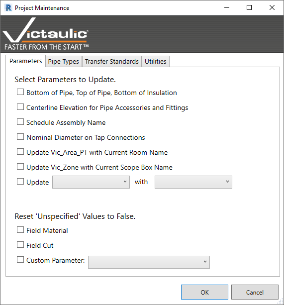
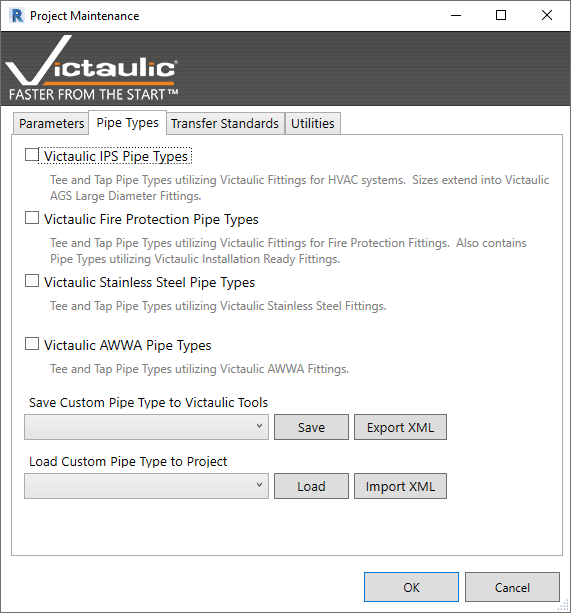
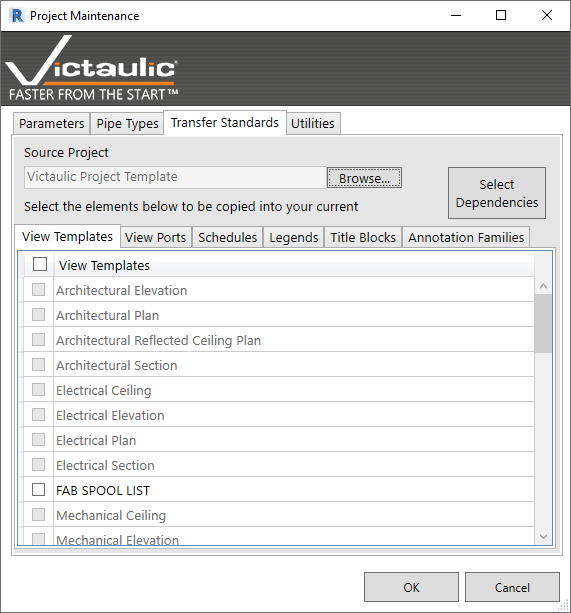
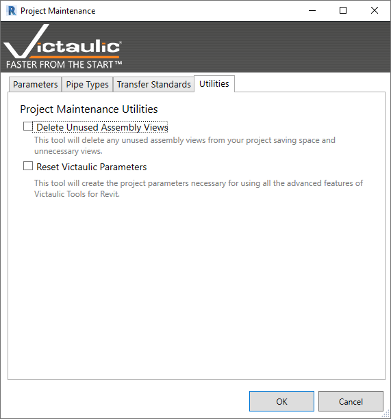

# Project Maintenance

This is a multi-function tool. There is a series of parameters to update with project data, plus a couple of tools for fixing issues with Yes/No parameters. The **Pipe Types** tab offers tools to install Victaulic pipe types and to back up and restore them.

## Select Parameters to Update

This section populates often-used shared parameters in the MEP BIM industry. Native Revit does not account for **Bottom of Pipe**, **Top of Pipe**, or **Bottom of Insulation**.

- **Centerline Elevation** — A shared parameter in Fabrication Pipework that is often needed in annotation tags.
- **Schedule Assembly Name** — A unique name given to each assembly created using the tool. If a user changes the assembly name, the shared parameter must be updated using this tool.
- The remaining checkboxes update shared parameters based on the **Room** and **Scope Box** that components are associated with.

## Yes/No Parameters

Yes/No parameters default to an unspecified value. This means they can't be used in formulas. This tool sets all unspecified values to **False (No)** to allow for formulas in schedules.

## Pipe Types Tab

The **Pipe Types** tab offers a quick way to install specific Victaulic Pipe Types without the fear of duplicated families from a copy / paste approach.

There are tools at the bottom for saving Pipe Types to be recalled in a different project. You can also export the XML instructions for each pipe type and import them on another installation of Victaulic Tools for Revit.

## Transfer Standards

**Transfer Standards** is a tool designed to assist in moving specific elements from project to project. The source project always defaults to the Victaulic Project Template, but any source project can be used.

Specific **View Templates**, **Viewports**, **Schedule Templates**, **Legends**, **Title Blocks**, and **Annotation Families** can be directly imported into your working project. Elements necessary for tagging and spooling with Victaulic Tools for Revit are automatically selected and imported.

## Utilities

- **Delete Unused Assembly Views** — As assembly sheets are created, extra views that aren't placed on the final drawing can add up. Use this option to delete any views associated with assemblies but not placed on the assembly sheet.

- **Reset Victaulic Parameters** — Victaulic Tools for Revit requires some Project Parameters to function correctly. These parameters need to be associated with certain categories of families. This option sets all the associations of Victaulic Parameters to their default and correct values.
