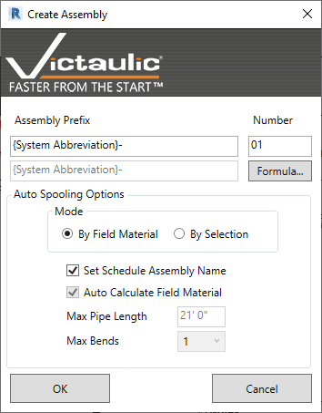
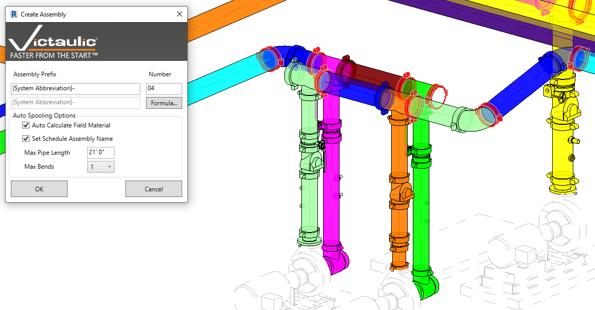

# Assembly Tools

## Auto Assembly

**Auto Assembly** is a selection-based or view-based tool that divides piping systems into logical fabrication assemblies. Variable parameters let the user define how to handle field cut items, typical assemblies, maximum pipe length, and maximum number of bends (elbows) per assembly.

### Two Ways to Use the Tool

**By Field Material**

1. Make a selection to limit the items to be assembled, or have nothing selected to assemble all items in your view.
2. Run **Auto Assembly**, specify the prefix for the spools (note: prefix formulas don't resolve until the assembly is created).
3. Use the **By Field Material** mode to create assemblies between predetermined Field Material and click **OK**. (See [Toggle Field Material](../pipe-tools/toggle-field-material.md).)

**By Parameters**

1. Make a selection to limit items, or leave nothing selected to assemble everything in your view.
2. Use the **By Parameters** mode and specify the prefix for the spools.
3. Adjust the variable parameters and click **OK**.

## Combine Assemblies

**Combine Assemblies** takes all assemblies in the user's selection and combines them into one Revit assembly, maintaining all parameter values of the chosen assembly.

> **Note:** Combine Assemblies will add loose items in your selection to an assembly.

## Split Assembly

**Split Assembly** takes a single assembly and lets the user select items to be removed and placed into another assembly. With the assembly renaming feature, this tool prevents the user from having to disassemble and reassemble multiple assemblies.
