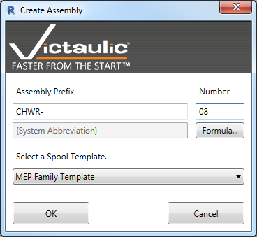
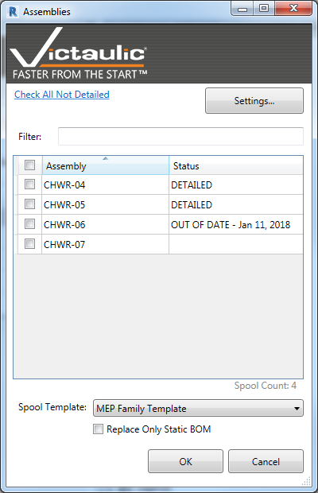

# Create Assembly and Views

**Create Assembly and Views** is a powerful tool to automate the detailing of assembly (spool) drawings. It uses predetermined settings to deliver a complete spool drawing with only a few clicks.

## Two Ways to Use the Tool

### Single Assembly

Select a group of components and choose **Create Assembly and Views** from the Victaulic Tools toolbar. You'll see a window similar to the assembly creation tool, with the **Spool Template** section now activated. Select one of your predetermined Spool Templates and click **OK**.

### Multiple Assemblies

To create views for assemblies already defined, ensure nothing is selected and click the **Create Assembly & Views** button. A list of assemblies is displayed allowing you to check off which views to create. This screen also includes a Spool Template selection.

Assemblies that already have sheets display as **DETAILED**. It is possible to create a new sheet for previously detailed assemblies — this process deletes any existing views and sheets and recreates them using the Spool Template settings.

> **Tip:** Use the **Settings…** button on this screen, or the **Settings** button on the Victaulic Tools toolbar, to access Spool Templates. See [Settings (Create Assembly Views)](settings-create-assembly-views.md) for the full list of options.

## Replace Only Static BOM

Use the **Replace Only Static BOM** option to refresh the bill of material on the sheet without affecting any custom detailing you've done to sheets and views.
