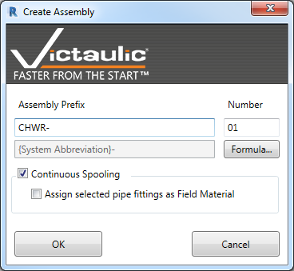
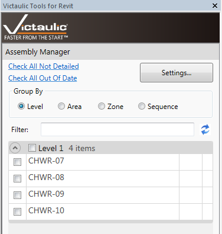
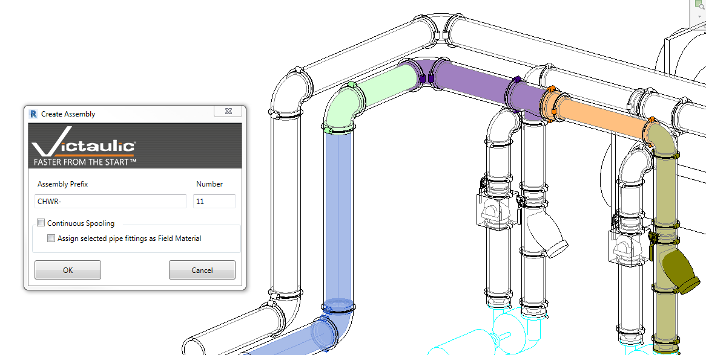
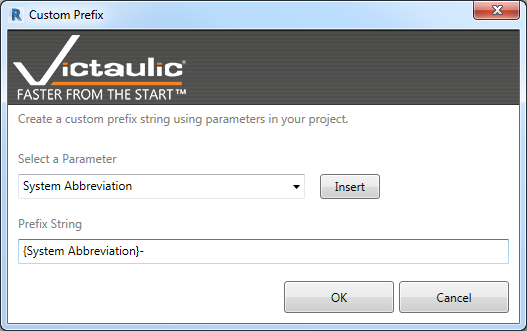
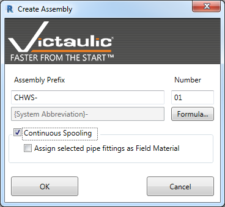
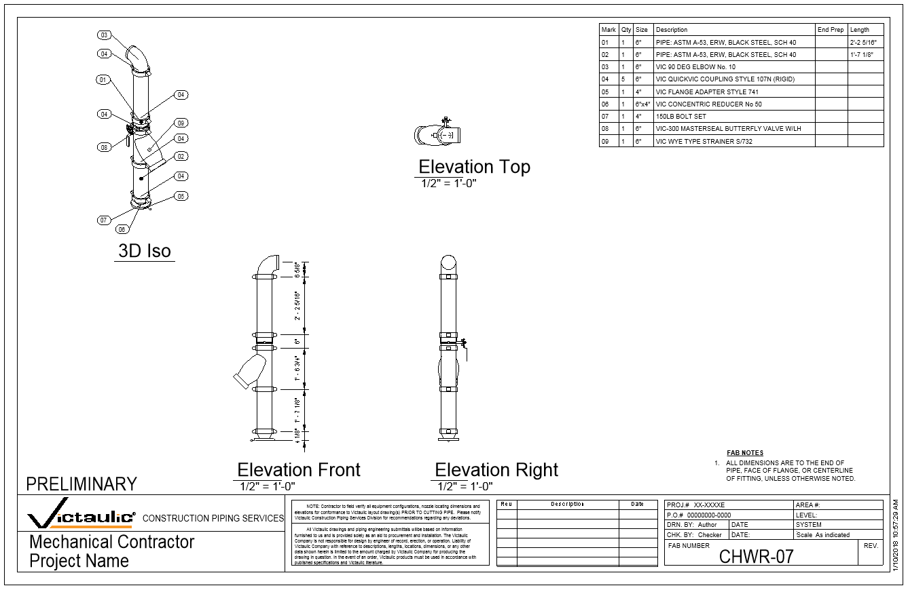

# Create Assembly / Continuous Spooling

This tool lets you select all the families you want in your assembly (spool) drawing. There are key differences from the native Revit assembly tool:

- This tool ensures all **nested families** are correctly brought into the assembly, where the native Revit tool ignores nested families.
- This tool keeps assemblies **completely separate** from each other. Using the native Revit tool will group assemblies if the parts selected are identical to a previous assembly.

Depending on your needs, you can use either Assembly Creation tool.

## Assembly Naming

The **Assembly Name** window lets you define the assembly prefix and sequence number. With the addition of formulas in the Create Assembly tool, parameters can be inserted as variables to populate the prefix value.

At the bottom of the project browser, you'll see your newly created assemblies. They also appear in the [Victaulic Dock — Assembly Manager](../dock/assembly-manager.md).

## Continuous Spooling

Using **Continuous Spooling**, you'll be prompted for the last component for each assembly. Components between your previous assembly and your selected element are automatically added to the new assembly and incrementally numbered.

## Field Material

**Field Material** can also be defined. With this option checked, the last element in every defined assembly is considered Field Material and the `Vic_Field Material` parameter is set as checked.

## Spooling View & Title Block

> **Tip:** Be sure to look at the Victaulic Project Template — it has views designed to assist in defining spools, fully equipped with View Templates, Viewports, and Title Blocks that can be customized for your needs.

Below is the **Spooling View** which colorizes components associated with an assembly:

  
  

And an example of an intelligent title block which reads information from your project:

