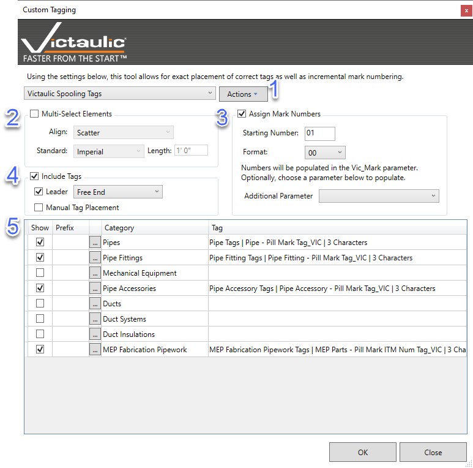

# Custom Tagging

**Custom Tagging** is a multi-function tool that assists in annotating multiple types of families. The user can select a proper annotation symbol per family category. The tool is split into 5 sections that can be used together.

## Templates

Templates can be used to save tag selections by family category.

## Multi-Select Elements

The **Multi-Select Elements** check box gives placement options: **Left**, **Right**, **Top**, **Bottom**, and **Scatter**.

- With **Multi-Select Elements** checked and **Manual Tag Placement** unchecked, tags are automatically aligned to your selection.
- With both checked, each component is highlighted in red while tags are being placed.

## Numbering

Options to incrementally number the selected family. The tool writes to the `Vic_Mark` shared parameter. Tags included with the Project Template have many example annotation families that use this shared parameter.

## Leaders

Available options are **Free End** and **Attached End**. This section also allows using the tool without placing tags — useful for renumbering components that already have annotations.

## Annotation Family Selection

Specify which annotation families the tool will use while placing tags. The **Show** column can be used to show / hide specific family categories — handy for locating families on complicated views. The **Prefix** column appends a text prefix to the `Vic Mark` shared parameter.

> **Tip:** This tool is useful when creating assembly drawings and fabrication maps. You must use **Tab** to select fittings in an assembly.
