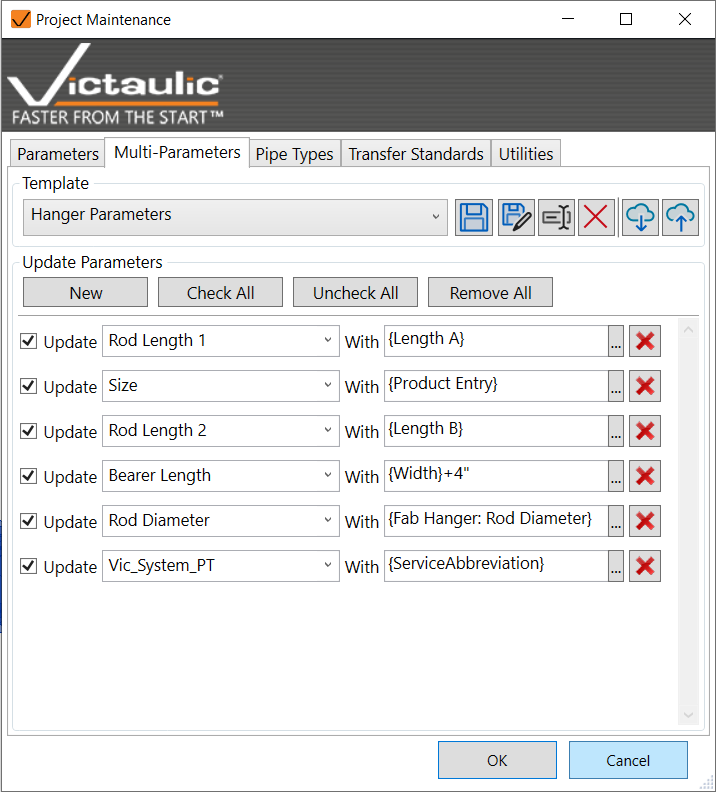

# Multi Parameters

Create templates to push data to parameters from any hidden or visible parameter in Revit. Rules can compound like Revit Filters.



## Supported Operations

Use simple addition and `if` statements:

```
{Width}+4"
{Fab Hanger: Rod Diameter}
{Length A}
if({Vic_Mark}=0, Yes, )
if({Category} = Pipes, {M_Weight}*{Length}, {M_Weight})
```

> **Note:** Parameters need to be the appropriate data type when used in `if` statements.

## Why It Exists

This tool was created to give access to Fabrication Part hidden data fields and to run formulas on project parameters for reports and tags.
