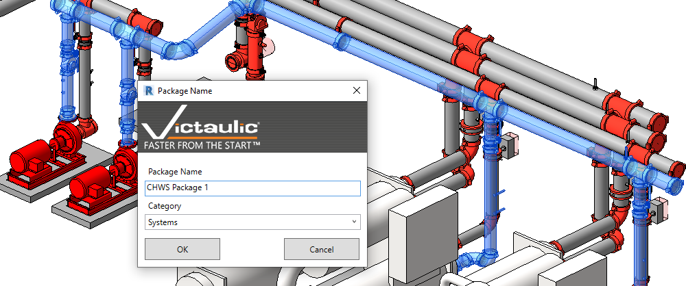
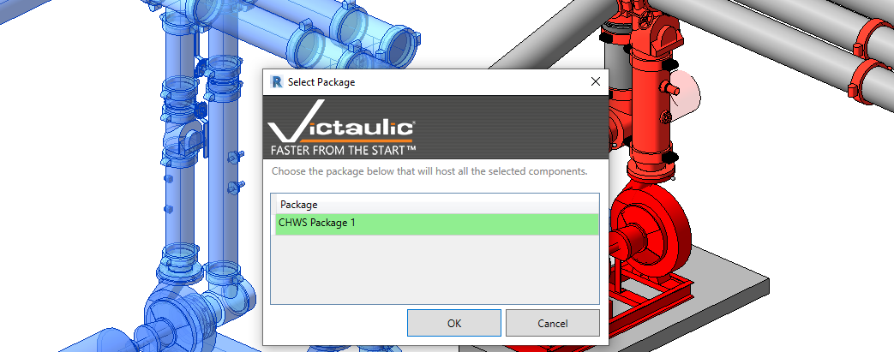
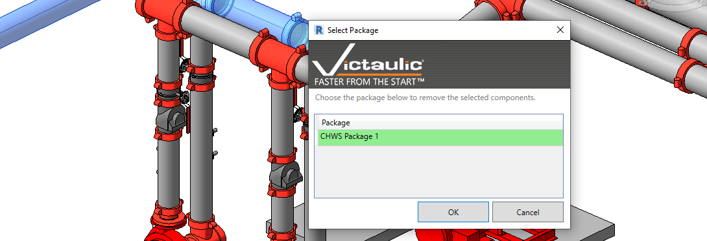

# Package Tools

## Create Package

The **Create Package** tool takes a user's selection (which may or may not contain assemblies) and creates a larger selection set. Packages can be detailed and tracked exactly like Revit Assemblies using the [Package Manager](../dock/package-manager.md) in the Victaulic Dock.

## Add To Package

The **Add To Package** button lets you select items outside a Package and choose which package to include them in. This is a much faster way of managing items within these selection sets, saving time when modeling changes are represented through fabrication.

## Remove From Package

The **Remove From Package** button takes the user's selection and removes it from a specified package. The user is prompted with a list of packages in their selection, and the selected package will have the selected items removed.

