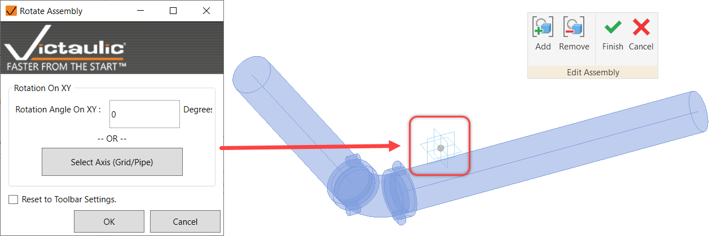

# Rotate Assembly

Batch-edit assembly origins when not rotated correctly to give assembly views in the correct orientation.

You can use **Rotate Assembly** followed by recreating assembly views to fix assembly view orientation. In the past you would need to reassemble the model or rotate each assembly individually.

> **Note:** Using `0` for **Rotation Angle On XY** resets the selected assemblies to have their origin aligned to project north. Using **Reset to Toolbar Settings** at the bottom uses the settings and logic specified in the VTFR settings for assembly creation.
