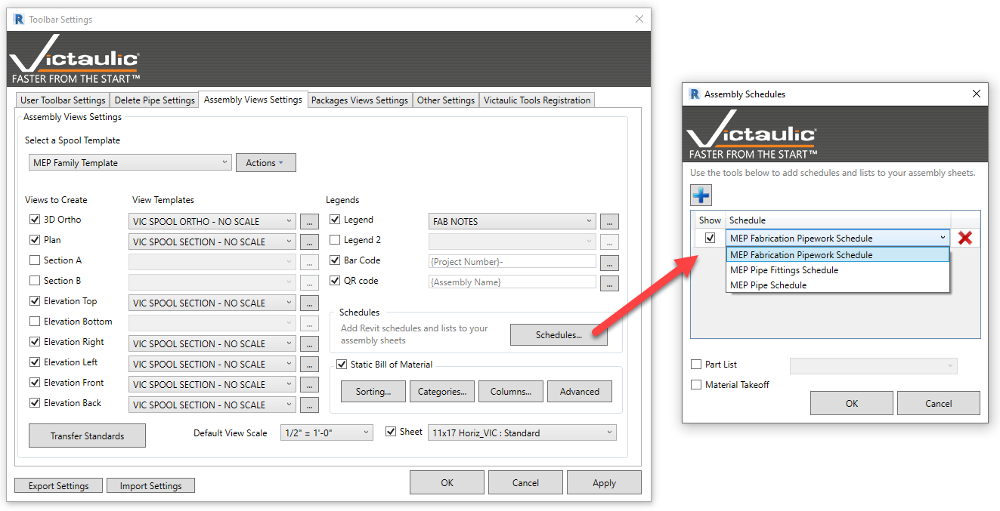
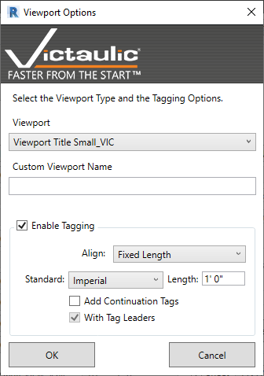

# Settings (Create Assembly Views)

Within the settings window for assembly views, define which views to create and the view template to use when views are placed on the selected spool sheet. **Bar Codes**, **QR Codes**, **Schedules**, **Legends**, and Victaulic's **Static Bill of Material** can be automatically generated using these settings.

## Transfer Standards

The **Transfer Standards** button provides quick access to the [Project Maintenance / Transfer Standards](../settings/project-maintenance.md) screen to automate spooling setup.

## Per-View Options

Additional settings for views and legends are available with the **…** button next to each view. In this form, you can select exactly which **Viewport** to use, with options for annotating the components.

The annotation behavior is similar to the [Custom Tagging](custom-tagging.md) tool when used in Multi-Select Elements mode. The annotation tags placed are from the first user-defined group in the Custom Tagging tool.

## Default View Scale

Use the **Default View Scale** option to set a default scale for all newly created views. View scales specified in View Templates take priority over this setting.

> **Note:** For more information on the Static Bill of Material, refer to the [Procurement Tool](../procurement-and-hangers/procurement-tool.md). The settings on this screen have identical functionality to the Packages View Settings.
