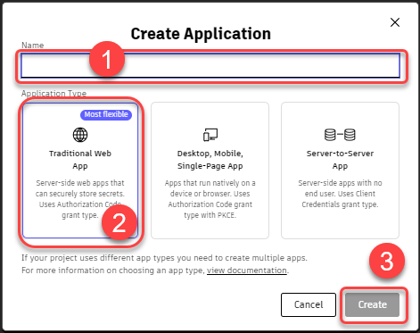
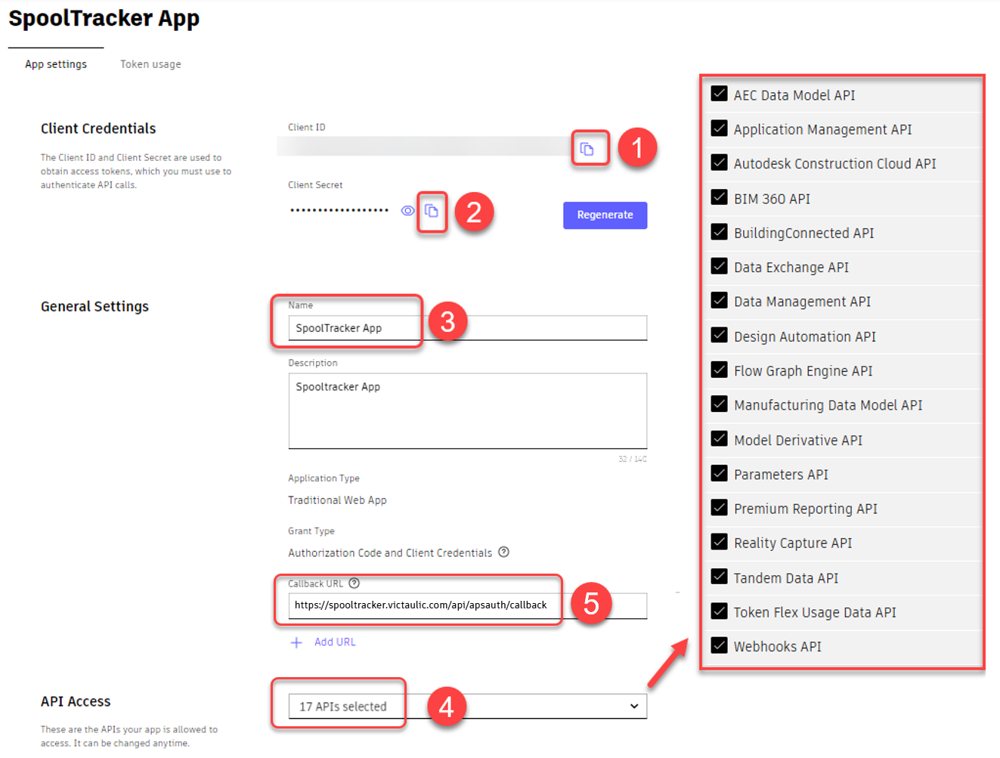
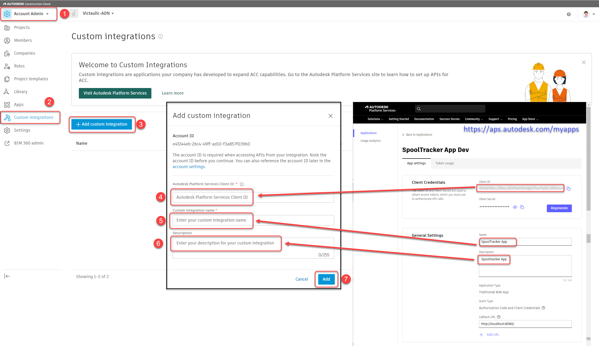
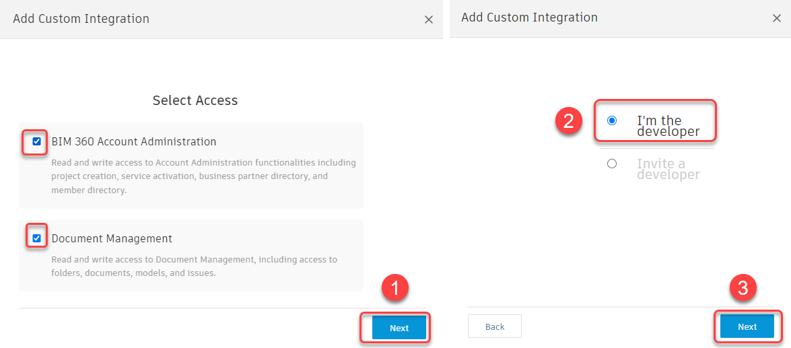
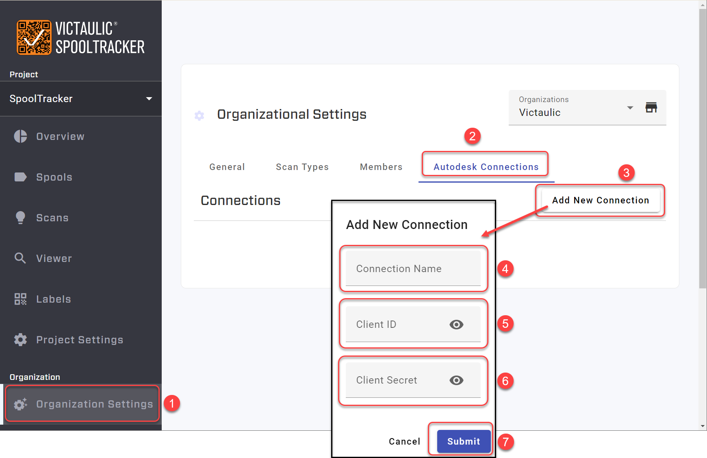
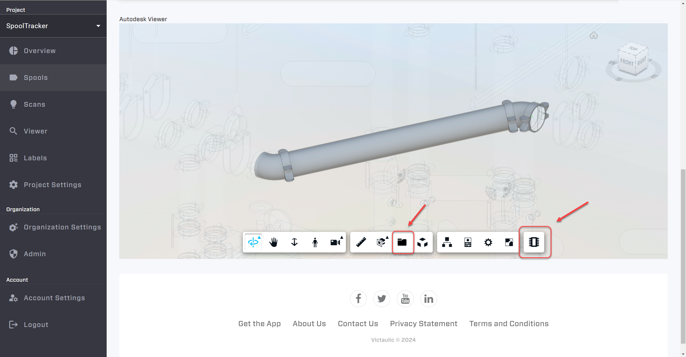

# Victaulic SpoolTracker ACC® Connection

## ACC® Viewer Setup

Published Views and Sheets from Revit can be viewed on the SpoolTracker Dashboard if a **Custom Integration** is created and linked to the ACC® hub. This Custom Integration is then linked in the SpoolTracker Dashboard.

## Step 1: Create an APS Application

Visit the Autodesk Platform Services site: [https://aps.autodesk.com/myapps](https://aps.autodesk.com/myapps).

1. Name the application: `SpoolTracker App`
2. Select **Traditional Web App**.
3. **Client ID** and **Client Secret** are created automatically. Copy them for safekeeping — they are needed to connect SpoolTracker to your ACC® hub.





## Step 2: Configure API Access

For API Access, only 4 APIs are currently required. To support new features, please **select all the additional APIs**.

The Callback URL also needs to be set to:

```
https://spooltracker.victaulic.com/api/apsauth/callback
```



> **Tip:** Add any other admins who may need to be aware of the connection in the **Collaborators** area at the bottom of the page. Save changes when done — changes can be made at any time via the link above.

## Step 3: Add Custom Integration in ACC

As an account administrator of the ACC® hub, you need to add the **Custom Integration** within the hub.

> **Note:** ACC® and BIM 360® use the same integration, so it's best to create your Custom Integration in ACC®.

You will need the **Client ID**, **App Name**, and **Description** from [https://aps.autodesk.com/](https://aps.autodesk.com/).



If these screens appear during setup, select the options shown. (In ACC® they should not appear.)



## Step 4: Connect SpoolTracker to ACC

In SpoolTracker, you'll need an **Organization** created by a Victaulic Administrator. As an administrator of the Organization, you can create an **Autodesk® Connection**.

- **Connection Name** — Anything to help identify the connection. `SpoolTracker App` works, or use the company / hub name when linking multiple hubs.
- **Client ID** and **Client Secret** — Both come from the [Autodesk Platform Services site](https://aps.autodesk.com/).



## Verification

After completing the setup, you should see any published views and sheets in the **Viewer** and **Spools** tabs of the SpoolTracker Dashboard.

> **See also:** the [SpoolTracker integration ACC guide](../../spooltracker/vtfr-integration/acc-connection.md) for the SpoolTracker-focused walkthrough.
